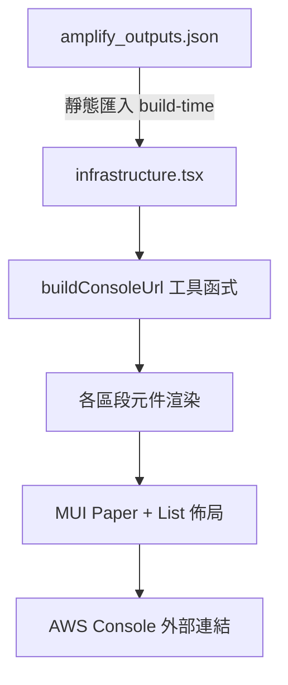

# 設計文件：AWS 資源連結頁面

## 概述

本功能新增一個受保護的 `/infrastructure` 路由頁面，讓已驗證使用者可以瀏覽專案中所有 AWS 資源的識別碼與 Console 連結。頁面在建置時從 `amplify_outputs.json` 靜態匯入資源設定，以純前端方式建構 AWS Console URL，不進行任何執行時期 API 呼叫。

頁面分為四個區段：Amazon Cognito、Amazon S3、AWS AppSync、Amazon DynamoDB，每個區段使用 MUI Paper 元件呈現，資源資訊以標籤-值配對方式排列，可點擊的連結附帶外部連結圖示並在新分頁開啟。

## 架構



### 設計決策

1. **靜態匯入 vs 執行時期載入**：選擇在建置時透過 `import outputs from '../../amplify_outputs.json'` 靜態匯入，因為資源識別碼在部署後不會變動，且避免額外的網路請求。這與 `src/main.tsx` 中的匯入方式一致。

2. **單一路由檔案 vs 拆分元件**：由於頁面邏輯簡單（純展示，無互動狀態），將所有內容放在單一路由檔案 `src/routes/infrastructure.tsx` 中，不額外拆分子元件。

3. **URL 建構函式獨立於 `src/lib/`**：將 AWS Console URL 建構邏輯抽取為 `src/lib/aws-console-urls.ts` 工具模組，方便單元測試與未來複用。

4. **DynamoDB 資料表名稱處理**：`amplify_outputs.json` 的 `model_introspection.models` 僅包含模型名稱，不包含實際 DynamoDB 資料表名稱。因此依據需求 5.4，以純文字顯示模型名稱，不附加連結。

## 元件與介面

### 路由檔案

**檔案路徑**：`src/routes/infrastructure.tsx`

```typescript
import { createFileRoute } from "@tanstack/react-router";
import { requireAuth } from "@/lib/route-guards";

export const Route = createFileRoute("/infrastructure")({
  beforeLoad: requireAuth,
  component: InfrastructurePage,
});
```

### URL 建構工具模組

**檔案路徑**：`src/lib/aws-console-urls.ts`

```typescript
export interface ConsoleUrlParams {
  region: string;
  resourceId: string;
}

/** 建構 Cognito User Pool Console URL */
export function buildCognitoUserPoolUrl(
  region: string,
  userPoolId: string,
): string;

/** 建構 Cognito Identity Pool Console URL */
export function buildCognitoIdentityPoolUrl(
  region: string,
  identityPoolId: string,
): string;

/** 建構 S3 Bucket Console URL */
export function buildS3BucketUrl(bucketName: string): string;

/** 建構 AppSync Console URL */
export function buildAppSyncUrl(region: string): string;

/** 建構 DynamoDB Table Console URL */
export function buildDynamoDBTableUrl(
  region: string,
  tableName: string,
): string;
```

### 頁面元件結構

```typescript
function InfrastructurePage(): JSX.Element;
```

頁面內部結構：

- 頁面標題：「AWS 資源連結」
- Cognito 區段（Paper）
  - User Pool ID（含連結）
  - App Client ID（純文字，無對應 Console 頁面）
  - Identity Pool ID（含連結）
- S3 區段（Paper）
  - Bucket Name（含連結）
  - AWS Region（純文字）
- AppSync 區段（Paper）
  - GraphQL Endpoint（含連結）
  - AWS Region（純文字）
- DynamoDB 區段（Paper）
  - 各模型名稱（純文字，因無法判斷實際資料表名稱）

### ResourceItem 輔助元件

頁面內部定義的輔助元件，用於統一渲染標籤-值配對：

```typescript
interface ResourceItemProps {
  label: string;
  value: string;
  href?: string; // 若提供則渲染為外部連結
}

function ResourceItem({ label, value, href }: ResourceItemProps): JSX.Element;
```

## 資料模型

本功能不引入新的資料模型。資料來源為 `amplify_outputs.json` 的靜態 JSON 結構：

### AmplifyOutputs 結構（相關欄位）

```typescript
interface AmplifyOutputs {
  auth: {
    user_pool_id: string;
    aws_region: string;
    user_pool_client_id: string;
    identity_pool_id: string;
  };
  data: {
    url: string;
    aws_region: string;
    model_introspection: {
      models: Record<string, { name: string }>;
    };
  };
  storage: {
    aws_region: string;
    bucket_name: string;
  };
}
```

### AWS Console URL 格式

| 服務                  | URL 格式                                                                                         |
| --------------------- | ------------------------------------------------------------------------------------------------ |
| Cognito User Pool     | `https://{region}.console.aws.amazon.com/cognito/v2/idp/user-pools/{userPoolId}/users`           |
| Cognito Identity Pool | `https://{region}.console.aws.amazon.com/cognito/v2/identity/identity-pools/{identityPoolId}`    |
| S3 Bucket             | `https://s3.console.aws.amazon.com/s3/buckets/{bucketName}`                                      |
| AppSync               | `https://{region}.console.aws.amazon.com/appsync/home?region={region}#/apis`                     |
| DynamoDB Table        | `https://{region}.console.aws.amazon.com/dynamodbv2/home?region={region}#table?name={tableName}` |

## 錯誤處理

本功能的錯誤場景有限，因為資料來源為建置時靜態匯入的 JSON：

1. **缺少欄位**：若 `amplify_outputs.json` 中缺少某個欄位（如 `identity_pool_id`），使用 optional chaining 安全存取，缺少時顯示「—」作為預設值。
2. **DynamoDB 資料表名稱不可得**：依需求 5.4，以純文字顯示模型名稱，不附加連結。此為預期行為，非錯誤。
3. **路由守衛**：未驗證使用者由 `requireAuth` 重新導向至首頁，無需額外錯誤處理。

## 測試策略

### 為何不使用屬性測試（Property-Based Testing）

本功能為純 UI 展示頁面，主要邏輯為：

- 從靜態 JSON 讀取固定值
- 以字串模板建構 URL
- 渲染 MUI 元件

這屬於「UI 渲染」與「簡單資料展示」類別，輸入空間固定且有限（來自 `amplify_outputs.json` 的已知結構），不存在需要透過大量隨機輸入驗證的通用性質。因此不適用屬性測試，改以範例式單元測試覆蓋。

### 單元測試

**測試檔案**：`src/lib/__tests__/aws-console-urls.test.ts`

測試 URL 建構函式：

- 各函式以已知輸入產生正確的 URL 格式
- 驗證 URL 中包含正確的 region 與 resource ID
- 邊界情況：含特殊字元的 resource ID

**測試檔案**：`src/routes/__tests__/infrastructure.test.tsx`

測試頁面渲染：

- 已驗證使用者可看到頁面標題「AWS 資源連結」
- 四個區段標題皆正確顯示
- 資源值從 mock 的 amplify_outputs.json 正確讀取並顯示
- 所有外部連結具有 `target="_blank"` 與 `rel="noopener noreferrer"`
- 所有外部連結具有外部連結圖示
- DynamoDB 區段以純文字顯示模型名稱

### 測試工具

- **Vitest**：測試執行器
- **React Testing Library**：元件渲染與查詢
- **Mock**：mock `amplify_outputs.json` 的匯入，提供測試用的固定值
