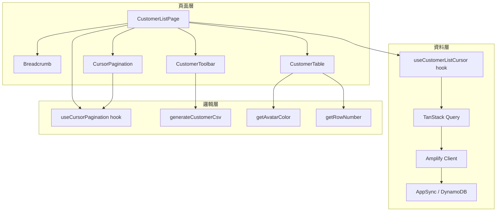
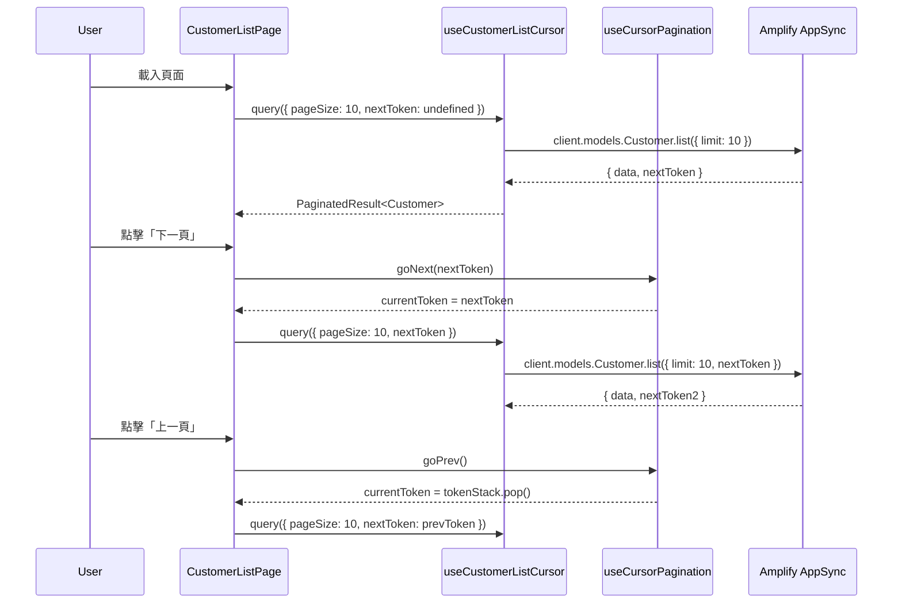

# 設計文件：客戶列表 UI 重構

## 概述

本設計文件描述客戶列表頁面的 UI 重構方案，將現有的簡易列表升級為功能完整的專業表格介面。重構涵蓋工具列整合、複合欄位、游標式分頁、批次選取、行操作按鈕及 CSV 匯出功能。

核心設計原則：

- **向後相容**：共用 `DataTable` 元件不做破壞性修改，客戶列表頁面使用獨立的表格實作
- **游標式分頁**：以 DynamoDB `nextToken` 為基礎，使用本地 token 堆疊支援上一頁導覽
- **純函式可測試**：將 CSV 產生、Avatar 色彩衍生、列號計算等邏輯抽離為純函式

## 架構



### 架構決策

1. **不修改共用 DataTable**：客戶列表頁面直接使用 TanStack Table + MUI Table 元件組合，避免影響其他使用 `DataTable` 的頁面。共用 `DataTable` 使用 offset-based 分頁（`TablePagination`），與游標式分頁不相容。

2. **獨立 hook 管理游標分頁**：新增 `useCursorPagination` hook 封裝 token 堆疊邏輯，與資料查詢 hook 分離，便於測試與複用。

3. **CSV 產生為純函式**：`generateCustomerCsv` 接收客戶陣列，回傳 CSV 字串（含 BOM），不依賴 React 狀態。

## 元件與介面

### 新增元件

#### `CustomerToolbar`

```typescript
interface CustomerToolbarProps {
  search: string;
  onSearchChange: (value: string) => void;
  totalCount: number;
  statusFilter: "all" | "active" | "inactive";
  onStatusFilterChange: (value: "all" | "active" | "inactive") => void;
  sortField: SortField;
  onSortFieldChange: (value: SortField) => void;
  onAddClick: () => void;
  onExportClick: () => void;
  isExporting: boolean;
}

type SortField = "name" | "contactPerson" | "phone" | "createdAt";
```

#### `UserInfoCell`

```typescript
interface UserInfoCellProps {
  name: string;
  contactPerson: string;
}
```

渲染結構：`Avatar`（左側）+ `Box`（右側，包含 name subtitle2 + contactPerson body2）

#### `CursorPagination`

```typescript
interface CursorPaginationProps {
  pageSize: number;
  onPageSizeChange: (size: number) => void;
  hasNextPage: boolean;
  hasPrevPage: boolean;
  onNextPage: () => void;
  onPrevPage: () => void;
  currentCount: number;
}
```

#### `RowActions`

```typescript
interface RowActionsProps {
  customer: Customer;
  onView: (customer: Customer) => void;
  onEdit: (customer: Customer) => void;
  onToggleActive: (customer: Customer) => void;
}
```

### 新增 Hooks

#### `useCursorPagination`

```typescript
interface CursorPaginationState {
  currentToken: string | undefined;
  pageSize: number;
  tokenStack: string[]; // 歷史 token 堆疊（不含 undefined 首頁）
}

interface CursorPaginationActions {
  goNext: (nextToken: string) => void;
  goPrev: () => void;
  setPageSize: (size: number) => void;
  reset: () => void;
}

function useCursorPagination(
  initialPageSize?: number,
): CursorPaginationState & CursorPaginationActions;
```

Token 堆疊運作方式：

- 首頁：`currentToken = undefined`，`tokenStack = []`
- 點擊下一頁：將 `currentToken` push 到 `tokenStack`，設定新的 `currentToken` 為後端回傳的 `nextToken`
- 點擊上一頁：從 `tokenStack` pop 出前一個 token 作為 `currentToken`
- 重置（變更 pageSize 或篩選）：清空 `tokenStack`，`currentToken = undefined`

#### `useCustomerListCursor`

```typescript
interface CustomerListCursorParams {
  pageSize: number;
  nextToken?: string;
  search?: string;
  isActive?: boolean; // undefined = 全部
  sortField?: SortField;
}

function useCustomerListCursor(
  params: CustomerListCursorParams,
): UseQueryResult<PaginatedResult<Customer>>;
```

### 純函式模組

#### `src/lib/customer-csv.ts`

```typescript
/** 產生客戶列表 CSV 字串（含 UTF-8 BOM） */
function generateCustomerCsv(customers: Customer[]): string;

/** 產生 CSV 檔案名稱 */
function getCustomerCsvFilename(date?: Date): string;
```

#### `src/lib/avatar-utils.ts`

```typescript
/** 從名稱字串衍生一致的背景色彩（hex） */
function getAvatarColor(name: string): string;

/** 取得名稱的第一個字元作為 Avatar 顯示文字 */
function getAvatarLetter(name: string): string;
```

#### `src/lib/table-utils.ts`

```typescript
/** 計算列號 */
function getRowNumber(page: number, pageSize: number, rowIndex: number): number;
```

## 資料模型

### 現有模型（無需修改）

```typescript
// shared/models/customer.ts
interface Customer {
  id: string;
  name: string;
  contactPerson: string;
  phone: string;
  email: string;
  address: string;
  isActive: boolean;
  createdAt: string;
  updatedAt: string;
}

// shared/models/order.ts
interface PaginatedResult<T> {
  items: T[];
  totalCount: number;
  nextToken?: string;
}
```

### 新增型別

```typescript
// 排序欄位
type SortField = "name" | "contactPerson" | "phone" | "createdAt";

// 狀態篩選
type StatusFilter = "all" | "active" | "inactive";

// 游標分頁狀態
interface CursorPaginationState {
  currentToken: string | undefined;
  pageSize: number;
  tokenStack: string[];
}
```

### 資料流



## 正確性屬性

_屬性（Property）是一種在系統所有有效執行中都應成立的特徵或行為——本質上是對系統應做什麼的形式化陳述。屬性作為人類可讀規格與機器可驗證正確性保證之間的橋樑。_

### 屬性 1：列號計算正確性

_對於任意_ 有效的頁碼（page ≥ 0）、每頁筆數（pageSize > 0）及列索引（rowIndex ≥ 0），`getRowNumber(page, pageSize, rowIndex)` 應回傳 `page × pageSize + rowIndex + 1`，且結果始終為正整數。

**驗證：需求 3.2**

### 屬性 2：Avatar 衍生一致性

_對於任意_ 非空字串 name，`getAvatarLetter(name)` 應回傳 name 的第一個字元，且 `getAvatarColor(name)` 對相同輸入始終回傳相同的有效十六進位色彩值（格式 `#RRGGBB`）。

**驗證：需求 2.3, 2.4**

### 屬性 3：選取狀態一致性

_對於任意_ 列集合與選取操作序列：

- 點擊全選後，所有列的選取狀態應為 true
- 點擊單列核取方塊應僅切換該列的選取狀態
- 當 0 < 已選取數 < 總列數時，標題核取方塊應為不確定狀態

**驗證：需求 5.1, 5.2, 5.4**

### 屬性 4：Token 堆疊行為

_對於任意_ 前進導覽序列（goNext 呼叫 n 次），token 堆疊長度應等於 n，且連續呼叫 goPrev 應以 LIFO 順序回傳先前的 token。當呼叫 reset 時，無論先前狀態為何，token 堆疊應清空且 currentToken 應為 undefined。

**驗證：需求 6.5, 6.6**

### 屬性 5：CSV 匯出正確性

_對於任意_ 客戶陣列，`generateCustomerCsv(customers)` 應產生：

- 以 UTF-8 BOM（`\uFEFF`）開頭的字串
- 包含標題列（客戶名稱、聯絡人、電話、Email、地址、狀態、建立日期）
- 資料列數等於輸入客戶數量
- 每列包含該客戶的所有對應欄位值

**驗證：需求 7.1, 7.2, 7.3**

### 屬性 6：排序產生有序輸出

_對於任意_ 客戶陣列與排序欄位，依該欄位排序後的結果應滿足：對於所有相鄰元素 (a, b)，`a[field] <= b[field]`（依字串比較）。

**驗證：需求 1.5**

## 錯誤處理

| 情境                       | 處理方式                                             |
| -------------------------- | ---------------------------------------------------- |
| API 查詢失敗               | 顯示 MUI Alert（error severity），保留上次成功的資料 |
| 停用/啟用操作失敗          | 關閉確認對話框，顯示錯誤 Alert                       |
| CSV 匯出失敗（資料為空）   | 顯示提示 Alert（info severity）「目前無資料可匯出」  |
| nextToken 無效（後端錯誤） | 重置分頁狀態，從第一頁重新載入                       |
| 網路斷線                   | TanStack Query 自動重試（預設 3 次），失敗後顯示錯誤 |

## 測試策略

### 屬性測試（Property-Based Testing）

使用 **fast-check** 函式庫，每個屬性至少 100 次迭代。

| 屬性                | 測試檔案                                                   | 說明                            |
| ------------------- | ---------------------------------------------------------- | ------------------------------- |
| 屬性 1：列號計算    | `src/lib/__tests__/table-utils.property.test.ts`           | 產生隨機 page/pageSize/rowIndex |
| 屬性 2：Avatar 衍生 | `src/lib/__tests__/avatar-utils.property.test.ts`          | 產生隨機中英文字串              |
| 屬性 3：選取狀態    | `src/hooks/__tests__/useSelection.property.test.ts`        | 產生隨機選取操作序列            |
| 屬性 4：Token 堆疊  | `src/hooks/__tests__/useCursorPagination.property.test.ts` | 產生隨機導覽序列                |
| 屬性 5：CSV 匯出    | `src/lib/__tests__/customer-csv.property.test.ts`          | 產生隨機客戶資料（含特殊字元）  |
| 屬性 6：排序        | `src/lib/__tests__/table-utils.property.test.ts`           | 產生隨機客戶陣列與排序欄位      |

每個測試標記格式：`Feature: customer-list-ui-refinement, Property {N}: {描述}`

### 單元測試（Example-Based）

| 測試目標              | 測試檔案                                                   | 涵蓋需求                |
| --------------------- | ---------------------------------------------------------- | ----------------------- |
| CustomerToolbar 渲染  | `src/routes/customers/__tests__/CustomerToolbar.test.tsx`  | 1.1, 1.3, 1.4, 1.6, 1.7 |
| UserInfoCell 渲染     | `src/routes/customers/__tests__/UserInfoCell.test.tsx`     | 2.1, 2.2                |
| 表格欄位結構          | `src/routes/customers/__tests__/CustomerTable.test.tsx`    | 3.1, 3.3, 3.4           |
| 行操作按鈕            | `src/routes/customers/__tests__/RowActions.test.tsx`       | 4.1–4.6                 |
| CursorPagination 渲染 | `src/routes/customers/__tests__/CursorPagination.test.tsx` | 6.1–6.4, 6.7            |
| 麵包屑與標題          | `src/routes/customers/__tests__/Breadcrumb.test.tsx`       | 8.1–8.3                 |
| CSV 檔案名稱          | `src/lib/__tests__/customer-csv.test.ts`                   | 7.4, 7.5                |

### 整合測試

| 測試目標     | 說明                                   |
| ------------ | -------------------------------------- |
| 完整頁面渲染 | Mock API，驗證工具列 + 表格 + 分頁整合 |
| 分頁導覽流程 | Mock 多頁資料，驗證 next/prev 正確請求 |
| 篩選 + 重置  | 變更篩選條件後驗證分頁重置             |
