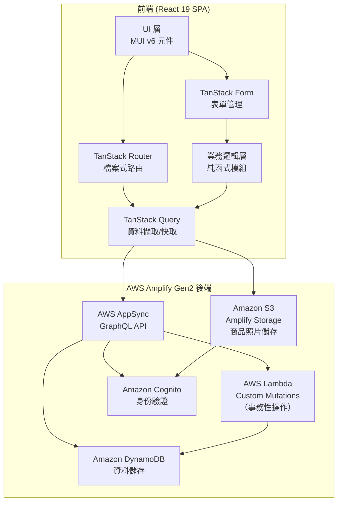
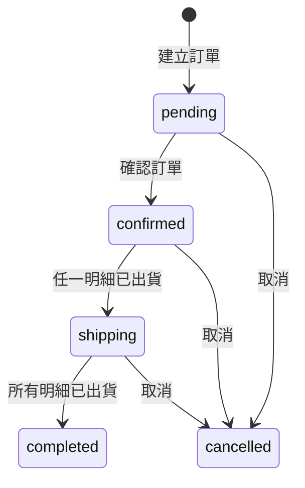
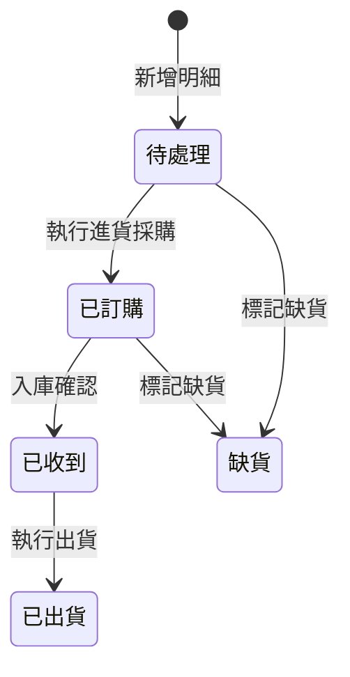
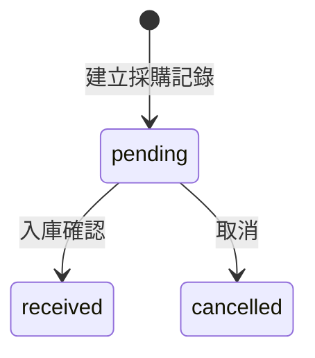

# 設計文件

## 概述

本設計文件描述電子商務訂單管理系統的技術架構與實作方案。系統建構於現有 React 19 + AWS Amplify Gen2 專案之上，使用 TanStack Router（檔案式路由）、TanStack Query（資料擷取與快取）、TanStack Table（表格管理）、TanStack Form（表單管理）及 MUI v6（UI 元件庫）。

系統涵蓋四大核心模組：

1. **Customer_Registry**：客戶基本資料 CRUD 與搜尋
2. **Supplier_Registry**：供應商基本資料 CRUD 與搜尋
3. **Product_Registry**：商品基本資料 CRUD、搜尋、規格組合（Product_Variant）管理及庫存追蹤
4. **Order_Manager**：訂單生命週期管理，包含明細項目狀態機、進貨採購/入庫、出貨/庫存扣減、訂單分拆與合併

核心業務流程：客戶下單 → 依訂單明細進貨採購 → 入庫確認（規格組合層級庫存增加）→ 出貨（規格組合層級庫存扣減）→ 訂單完成。

商品支援多維度規格選項（如顏色、尺寸），系統自動產生規格組合（Product_Variant），每個組合擁有獨立的 SKU、庫存數量及可選的單價/成本覆寫。訂單明細在商品具有規格組合時，必須指定特定的規格組合，進貨入庫與出貨扣減皆在規格組合層級操作。

### 設計決策

- **後端資料層**：使用 Amplify Gen2 Data（基於 AWS AppSync + DynamoDB）定義 GraphQL schema，自動產生 CRUD API。選擇此方案是因為專案已使用 Amplify Gen2，可直接整合認證與授權。
- **商品規格組合資料模型**：採用 Product → ProductVariant 的一對多關聯（`hasMany` / `belongsTo`），而非將規格組合嵌入 Product 的 JSON 欄位。原因：(1) 每個 ProductVariant 有獨立的庫存數量，需要獨立更新；(2) 訂單明細的 `variantId` 可直接建立外鍵關聯；(3) 避免 DynamoDB 400KB 項目大小限制問題。
- **DynamoDB 複合鍵（Composite Keys）**：為 Order 設定複合主鍵（PK: `CUSTOMER#{customerId}`, SK: `ORDER#{createdAt}`），大幅提升「查詢特定客戶所有訂單」的效能並支援時間範圍排序，避免依賴代價較高的 GSI。PurchaseRecord 同理設定（PK: `LINEITEM#{lineItemId}`, SK: `PURCHASE#{purchasedAt}`）。在 Amplify Gen2 Data schema 中透過 `identifier` 與 `secondaryIndexes` 設定。
- **樂觀併發控制（Optimistic Concurrency）**：在 ProductVariant 與 Product 模型中加入 `version: number` 欄位。Lambda Custom Mutation 執行庫存扣減時，使用 DynamoDB `ConditionExpression` 檢查 `version` 值，確保併發下單時庫存扣減準確。更新成功後 `version` 自動遞增。若版本不符則回傳衝突錯誤，前端重新取得最新資料後重試。
- **事務性操作（Custom Mutations）**：出貨、入庫等涉及多表更新的操作（如「扣減庫存 + 更新明細狀態 + 更新訂單狀態」），使用 Amplify Gen2 的 custom mutations（Lambda 函式）實作，透過 DynamoDB `TransactWriteItems` 確保原子性。避免前端分步呼叫多個 mutation 導致資料不一致。需要 custom mutation 的操作包括：
  - **出貨操作**：扣減 ProductVariant（或 Product）庫存 + 更新 LineItem 已出貨數量與狀態 + 條件性更新 Order 狀態
  - **入庫確認**：增加 ProductVariant（或 Product）庫存 + 更新 PurchaseRecord 狀態 + 更新 LineItem 狀態
  - **訂單合併**：建立新 Order + 搬移 LineItems + 取消來源 Orders
  - **訂單分拆**：建立多筆新 Orders + 分配 LineItems + 取消原 Order
- **前端狀態管理**：使用 TanStack Query 管理伺服器狀態快取與同步，不額外引入全域狀態管理庫。所有業務邏輯（狀態轉換驗證、金額計算、庫存檢查）封裝於獨立的純函式模組，方便測試。
- **TanStack Query 快取策略**：
  - **樂觀更新（Optimistic Updates）**：對於狀態變更操作（出貨、入庫確認、訂單狀態切換），在 `useMutation` 的 `onMutate` 中先更新快取，讓使用者立即看到 UI 變化，無需等待 Lambda 執行完畢（通常 1-2 秒）。若 mutation 失敗，在 `onError` 中自動回滾至先前狀態。
  - **自動預取（Prefetching）**：在訂單列表頁面，當使用者將游標懸停在某筆訂單時，使用 `queryClient.prefetchQuery` 預取該訂單的 LineItems 與 PurchaseRecords 資料，提升進入詳情頁的流暢感。
  - **快取失效（Invalidation）**：Custom mutation 成功後，invalidate 相關的 query keys（如 Order 詳情、Product/ProductVariant 庫存），確保資料最終一致。
- **表格管理**：使用 TanStack Table 管理 DataTable 元件，提供排序、分頁、欄位定義等功能，搭配 MUI 元件渲染。
- **表單驗證**：使用 TanStack Form 搭配自訂驗證函式，驗證邏輯抽離為純函式以利單元測試。
- **表單與 MUI 整合**：封裝 `FormField` 元件橋接 TanStack Form 的 `field.state` 與 MUI 受控元件（TextField 等），自動綁定 `value`/`onChange`、`error`/`helperText`，減少每個表單欄位的樣板程式碼。所有表單頁面統一使用 `FormField` 而非直接操作 `field` API。
  - **非同步驗證（onBlurAsync）**：需要呼叫 API 的驗證（如 SKU 唯一性檢查）使用 TanStack Form 的 `onBlurAsync` 觸發，避免每次按鍵輸入都發送後端請求。驗證中顯示 CircularProgress 指示。
  - **欄位依賴管理**：利用 TanStack Form 的 `form.subscribe` 監聽欄位變更。例如訂單明細中，當 `productId` 變更時，自動清空 `variantId` 並重新載入該商品的規格組合選項。
- **路由結構**：遵循現有檔案式路由慣例，管理頁面放置於 `src/routes/` 下，受保護路由使用 `beforeLoad` 搭配 redirect。
- **檔案儲存**：使用 Amplify Gen2 Storage（基於 Amazon S3）管理商品照片的上傳、刪除與存取。選擇此方案是因為 Amplify Gen2 提供 `defineStorage` 原生整合 Cognito 授權，可直接設定路徑前綴的存取規則，並透過 `uploadData`、`remove`、`getUrl` 等 API 簡化前端與 S3 的互動，無需自行管理 AWS SDK 或預簽名 URL 邏輯。
- **圖片上傳效能優化**：
  - **前端壓縮**：上傳前使用 Canvas API 將圖片壓縮至合理尺寸（如最大寬度 1200px、品質 0.8），減少上傳時間與 S3 儲存成本。
  - **縮圖產生**：上傳完成後透過 S3 觸發 Lambda 函式自動產生縮圖（如 300px 寬），使用 `sharp` 套件處理圖片（Node.js 效能最佳、資源消耗最低的圖片處理方案）。縮圖存放於 `product-images/{productId}/thumbnails/` 路徑。列表頁面與預覽使用縮圖，詳情頁面點擊後載入原圖。
  - **S3 物件標籤**：上傳時為圖片加上 `productId` 標籤（S3 Object Tagging），方便未來批次清理無效圖片（如刪除商品時）或進行儲存分析。
  - **S3 權限控制**：在 `amplify/storage/resource.ts` 中設定嚴格的路徑權限，僅已驗證使用者可上傳至 `product-images/` 路徑，所有已驗證使用者可讀取。

## 架構



### 前端分層架構

```
amplify/
├── auth/
│   └── resource.ts            # 認證設定（Cognito）
├── data/
│   └── resource.ts            # 資料模型定義（AppSync + DynamoDB）
├── functions/                 # Custom Mutation Lambda 函式
│   ├── ship-line-item/        # 出貨操作（庫存扣減 + 狀態更新，TransactWriteItems）
│   ├── confirm-received/      # 入庫確認（庫存增加 + 狀態更新，TransactWriteItems）
│   ├── merge-orders/          # 訂單合併（建立新訂單 + 搬移明細 + 取消來源，TransactWriteItems）
│   └── split-order/           # 訂單分拆（建立多筆新訂單 + 分配明細 + 取消原訂單，TransactWriteItems）
├── storage/
│   └── resource.ts            # 儲存設定（S3 商品照片）
└── backend.ts                 # 後端進入點

src/
├── routes/                    # 頁面路由（檔案式路由）
│   ├── __root.tsx             # 根佈局（導覽列）
│   ├── index.tsx              # 儀表板首頁
│   ├── customers/             # 客戶管理頁面
│   │   ├── index.tsx          # 客戶列表
│   │   ├── new.tsx            # 新增客戶
│   │   └── $customerId.tsx    # 編輯客戶
│   ├── suppliers/             # 供應商管理頁面
│   │   ├── index.tsx          # 供應商列表
│   │   ├── new.tsx            # 新增供應商
│   │   └── $supplierId.tsx    # 編輯供應商
│   ├── products/              # 商品管理頁面
│   │   ├── index.tsx          # 商品列表
│   │   ├── new.tsx            # 新增商品
│   │   └── $productId.tsx     # 編輯商品
│   └── orders/                # 訂單管理頁面
│       ├── index.tsx          # 訂單列表
│       ├── new.tsx            # 新增訂單
│       ├── $orderId.tsx       # 訂單詳情（含明細、進貨、出貨操作）
│       ├── merge.tsx          # 訂單合併
│       └── $orderId.split.tsx # 訂單分拆
├── models/                    # 資料模型型別定義與序列化
│   ├── customer.ts
│   ├── supplier.ts
│   ├── product.ts             # 含 Product、SpecDimension、ProductVariant 型別
│   ├── order.ts
│   └── index.ts
├── logic/                     # 業務邏輯純函式
│   ├── order-status.ts        # 訂單狀態轉換驗證
│   ├── line-item-status.ts    # 明細項目狀態轉換驗證
│   ├── purchase-record.ts     # 採購記錄狀態與數量驗證
│   ├── shipment.ts            # 出貨數量與庫存驗證（規格組合層級）
│   ├── order-calculations.ts  # 金額計算（小計、總金額）
│   ├── order-merge.ts         # 訂單合併邏輯
│   ├── order-split.ts         # 訂單分拆邏輯
│   ├── product-variant.ts     # 規格組合產生、SKU 產生、價格/成本解析
│   ├── validation.ts          # 表單驗證規則
│   └── serialization.ts       # 序列化/反序列化工具
├── hooks/                     # 共用 React Hooks
│   ├── useCustomers.ts        # 客戶 CRUD hooks (TanStack Query)
│   ├── useSuppliers.ts        # 供應商 CRUD hooks
│   ├── useProducts.ts         # 商品 CRUD hooks（含規格組合 CRUD）
│   ├── useProductImages.ts    # 商品照片上傳/刪除/取得 URL hooks (Amplify Storage)
│   ├── useOrders.ts           # 訂單 CRUD hooks
│   └── useDashboard.ts        # 儀表板摘要 hooks
├── components/                # 共用 UI 元件
│   ├── DataTable.tsx           # 通用分頁表格元件（TanStack Table + MUI）
│   ├── SearchBar.tsx           # 搜尋列元件
│   ├── ConfirmDialog.tsx       # 確認對話框
│   ├── StatusChip.tsx          # 狀態標籤元件
│   ├── EntitySelect.tsx        # 實體選取元件（客戶/供應商/商品）
│   ├── VariantSelect.tsx       # 規格組合選取元件（商品規格組合下拉選取）
│   ├── VariantTable.tsx        # 規格組合表格元件（顯示/編輯規格組合列表）
│   ├── ImageUploader.tsx       # 商品照片上傳與管理元件
│   └── FormField.tsx           # TanStack Form + MUI 整合元件（自動綁定 error/helperText）
├── auth/
│   └── AuthProvider.tsx       # 既有認證 Context
├── theme.ts                   # MUI 主題設定
└── main.tsx                   # 應用程式進入點
```

## 元件與介面

### 1. Customer_Registry 模組

**頁面元件：**

- `CustomerListPage`：分頁列表 + 搜尋，使用 `DataTable` 與 `SearchBar`
- `CustomerFormPage`：新增/編輯表單，使用 TanStack Form

**Hooks：**

```typescript
// useCustomers.ts
function useCustomerList(params: {
  page: number;
  search?: string;
}): UseQueryResult<PaginatedResult<Customer>>;
function useCustomer(id: string): UseQueryResult<Customer>;
function useCreateCustomer(): UseMutationResult<
  Customer,
  Error,
  CreateCustomerInput
>;
function useUpdateCustomer(): UseMutationResult<
  Customer,
  Error,
  UpdateCustomerInput
>;
```

### 2. Supplier_Registry 模組

**頁面元件：**

- `SupplierListPage`：分頁列表 + 搜尋
- `SupplierFormPage`：新增/編輯表單

**Hooks：**

```typescript
// useSuppliers.ts
function useSupplierList(params: {
  page: number;
  search?: string;
}): UseQueryResult<PaginatedResult<Supplier>>;
function useSupplier(id: string): UseQueryResult<Supplier>;
function useCreateSupplier(): UseMutationResult<
  Supplier,
  Error,
  CreateSupplierInput
>;
function useUpdateSupplier(): UseMutationResult<
  Supplier,
  Error,
  UpdateSupplierInput
>;
```

### 3. Product_Registry 模組

**頁面元件：**

- `ProductListPage`：分頁列表 + 搜尋（顯示庫存數量；有規格組合的商品顯示各規格組合庫存加總）
- `ProductFormPage`：新增/編輯表單（供應商選取使用 `EntitySelect`，含規格維度定義區塊與規格組合表格）

**Hooks：**

```typescript
// useProducts.ts
function useProductList(params: {
  page: number;
  search?: string;
}): UseQueryResult<PaginatedResult<Product>>;
function useProduct(id: string): UseQueryResult<Product>;
function useCreateProduct(): UseMutationResult<
  Product,
  Error,
  CreateProductInput
>;
function useUpdateProduct(): UseMutationResult<
  Product,
  Error,
  UpdateProductInput
>;

// 規格組合 CRUD hooks
function useCreateVariant(): UseMutationResult<
  ProductVariant,
  Error,
  { productId: string; variant: CreateVariantInput }
>;
// 為指定商品新增單一規格組合，自動產生 SKU（若未自訂）。

function useUpdateVariant(): UseMutationResult<
  ProductVariant,
  Error,
  { productId: string; variantId: string; updates: UpdateVariantInput }
>;
// 更新規格組合的 SKU、單價覆寫、成本覆寫或庫存數量。

function useDeleteVariant(): UseMutationResult<
  void,
  Error,
  { productId: string; variantId: string }
>;
// 刪除指定規格組合（僅在該規格組合無關聯的訂單明細時允許）。

function useGenerateVariants(): UseMutationResult<
  ProductVariant[],
  Error,
  { productId: string; specDimensions: SpecDimension[] }
>;
// 根據規格維度自動產生所有規格組合（笛卡爾積），
// 已存在的組合保留不變，僅新增缺少的組合。
```

**商品照片管理 Hooks：**

```typescript
// useProductImages.ts
// 使用 Amplify Gen2 Storage API（uploadData、remove、getUrl）管理 S3 商品照片

function useUploadProductImage(): UseMutationResult<
  string, // 回傳新增的 S3 key
  Error,
  { productId: string; file: File }
>;
// 將檔案上傳至 S3 的 product-images/{productId}/ 路徑，
// 上傳成功後將 S3 key 新增至商品的 imageUrls 陣列並更新商品記錄。

function useDeleteProductImage(): UseMutationResult<
  void,
  Error,
  { productId: string; imageKey: string }
>;
// 使用 Amplify Storage remove 刪除 S3 檔案，
// 同時從商品的 imageUrls 陣列中移除對應 key 並更新商品記錄。

function useProductImageUrls(imageKeys: string[]): UseQueryResult<string[]>;
// 使用 Amplify Storage getUrl 將 S3 key 列表轉換為可存取的預簽名 URL 列表，
// 供前端  標籤顯示使用。

function useProductThumbnailUrls(imageKeys: string[]): UseQueryResult<string[]>;
// 將 S3 key 列表轉換為對應縮圖的預簽名 URL 列表（路徑加入 thumbnails/ 前綴），
// 用於列表頁面與預覽顯示，減少頁面載入時間。
```

### 4. Order_Manager 模組

**頁面元件：**

- `OrderListPage`：訂單分頁列表 + 搜尋 + 合併操作入口
- `OrderFormPage`：新增訂單（客戶選取 + 明細項目新增）
- `OrderDetailPage`：訂單詳情（明細列表、進貨操作、出貨操作、狀態變更）
- `OrderMergePage`：選取同一客戶訂單進行合併
- `OrderSplitPage`：指定明細分配方式進行分拆

**Hooks：**

```typescript
// useOrders.ts
function useOrderList(params: {
  page: number;
  search?: string;
}): UseQueryResult<PaginatedResult<Order>>;
function useOrder(id: string): UseQueryResult<Order>;
function useCreateOrder(): UseMutationResult<Order, Error, CreateOrderInput>;
function useUpdateOrderStatus(): UseMutationResult<
  Order,
  Error,
  { orderId: string; newStatus: OrderStatus }
>;
function useCreatePurchaseRecord(): UseMutationResult<
  PurchaseRecord,
  Error,
  CreatePurchaseRecordInput
>;
function useConfirmReceived(): UseMutationResult<
  PurchaseRecord,
  Error,
  { purchaseRecordId: string }
>;
function useShipLineItem(): UseMutationResult<void, Error, ShipLineItemInput>;
function useMergeOrders(): UseMutationResult<
  Order,
  Error,
  { orderIds: string[] }
>;
function useSplitOrder(): UseMutationResult<Order[], Error, SplitOrderInput>;
```

### 5. 共用元件

```typescript
// DataTable.tsx — 通用分頁表格（基於 TanStack Table）
// 使用 @tanstack/react-table 的 useReactTable + getCoreRowModel
// 搭配 MUI 的 Table、TableHead、TableBody、TableRow、TableCell、TablePagination 渲染
interface DataTableProps<T> {
  columns: ColumnDef<T, unknown>[]; // TanStack Table 欄位定義
  data: T[];
  totalCount: number;
  page: number;
  pageSize: number;
  onPageChange: (page: number) => void;
  onPageSizeChange: (pageSize: number) => void;
  isLoading: boolean;
  onRowClick?: (row: T) => void;
  enableSorting?: boolean; // 預設 true
}

// SearchBar.tsx — 搜尋列
interface SearchBarProps {
  value: string;
  onChange: (value: string) => void;
  placeholder?: string;
}

// EntitySelect.tsx — 實體選取（Autocomplete）
interface EntitySelectProps<T> {
  label: string;
  value: T | null;
  onChange: (value: T | null) => void;
  searchFn: (query: string) => Promise<T[]>;
  getOptionLabel: (option: T) => string;
}

// StatusChip.tsx — 狀態標籤
interface StatusChipProps {
  status: string;
  colorMap: Record<
    string,
    | "default"
    | "primary"
    | "secondary"
    | "error"
    | "info"
    | "success"
    | "warning"
  >;
}

// ImageUploader.tsx — 商品照片上傳與管理元件
// 整合 useProductImages hooks，提供照片上傳、預覽、刪除功能
// 上傳前使用 Canvas API 壓縮圖片（最大寬度 1200px、品質 0.8），減少上傳時間
// 使用 MUI Button + 隱藏的 <input type="file" accept="image/*" multiple> 實作多檔選取
// 上傳中顯示 CircularProgress，已上傳照片以 ImageList 或 Grid 排列（使用縮圖 URL）
// 每張照片旁顯示刪除按鈕（IconButton + DeleteIcon），點擊後彈出 ConfirmDialog 確認
interface ImageUploaderProps {
  productId: string; // 商品 ID（用於 S3 路徑前綴）
  imageKeys: string[]; // 目前已上傳的 S3 key 列表
  onUploadComplete: (newImageKey: string) => void; // 上傳完成回呼
  onDeleteComplete: (deletedImageKey: string) => void; // 刪除完成回呼
  disabled?: boolean; // 是否停用上傳/刪除操作
  maxWidth?: number; // 壓縮最大寬度（預設 1200）
  quality?: number; // 壓縮品質 0-1（預設 0.8）
}

// VariantSelect.tsx — 規格組合選取元件
// 用於訂單明細新增時，當選取的商品具有規格組合，顯示下拉選單供使用者選取特定規格組合
// 使用 MUI Autocomplete，選項標籤顯示規格組合名稱（如「黑 L」）及庫存數量
interface VariantSelectProps {
  productId: string; // 商品 ID
  variants: ProductVariant[]; // 該商品的所有規格組合
  value: ProductVariant | null; // 目前選取的規格組合
  onChange: (variant: ProductVariant | null) => void; // 選取變更回呼
  error?: string; // 驗證錯誤訊息（如「請選取規格組合」）
  disabled?: boolean;
}

// VariantTable.tsx — 規格組合表格元件
// 用於商品詳情/編輯頁面，以表格形式顯示所有規格組合
// 使用 DataTable 元件，欄位包含：規格組合名稱、SKU、單價、進貨成本、庫存數量
// 支援行內編輯 SKU、單價覆寫、成本覆寫
interface VariantTableProps {
  productId: string; // 商品 ID
  variants: ProductVariant[]; // 規格組合列表
  defaultUnitPrice: number; // 商品預設單價（用於顯示未覆寫時的值）
  defaultCost: number; // 商品預設進貨成本
  onUpdateVariant: (variantId: string, updates: UpdateVariantInput) => void;
  onDeleteVariant: (variantId: string) => void;
  isLoading?: boolean;
}

// FormField.tsx — TanStack Form + MUI 整合元件
// 封裝 TanStack Form 的 field.state 與 MUI 受控元件的綁定，自動處理：
// - value / onChange 雙向綁定
// - error 狀態（field.state.meta.isTouched && field.state.meta.errors.length > 0）
// - helperText 顯示第一個驗證錯誤訊息
// - 必填欄位標記星號（*）
// 減少每個表單欄位的樣板程式碼，統一錯誤顯示風格
interface FormFieldProps<TData> {
  form: FormApi<TData>; // TanStack Form 實例
  name: DeepKeys<TData>; // 欄位路徑（型別安全）
  label: string; // 欄位標籤
  required?: boolean; // 是否必填（預設 false）
  type?: "text" | "number" | "email" | "password"; // 輸入類型（預設 'text'）
  multiline?: boolean; // 是否多行（預設 false）
  rows?: number; // 多行時的行數
  disabled?: boolean;
  fullWidth?: boolean; // 預設 true
  children?: (field: FieldApi<TData>) => React.ReactNode; // 自訂渲染（用於非 TextField 的元件，如 EntitySelect、VariantSelect）
}
```

### 6. 業務邏輯純函式介面

```typescript
// order-status.ts
function isValidOrderStatusTransition(
  from: OrderStatus,
  to: OrderStatus,
): boolean;
function getNextAllowedOrderStatuses(current: OrderStatus): OrderStatus[];

// line-item-status.ts
function isValidLineItemStatusTransition(
  from: LineItemStatus,
  to: LineItemStatus,
): boolean;
function getNextAllowedLineItemStatuses(
  current: LineItemStatus,
): LineItemStatus[];

// purchase-record.ts
function isValidPurchaseStatusTransition(
  from: PurchaseRecordStatus,
  to: PurchaseRecordStatus,
): boolean;
function calculateRemainingPurchaseQuantity(
  orderQuantity: number,
  purchasedQuantity: number,
): number;
function validatePurchaseQuantity(
  requestedQty: number,
  remainingQty: number,
): ValidationResult;
function applyReceived(stockQuantity: number, receivedQty: number): number;
// 入庫確認後計算新庫存：回傳 stockQuantity + receivedQty。
// 呼叫端負責判斷應更新規格組合層級或商品層級的庫存。

// shipment.ts
function calculateRemainingShipQuantity(
  orderQuantity: number,
  shippedQuantity: number,
): number;
function validateShipment(
  requestedQty: number,
  remainingShipQty: number,
  stockQuantity: number,
): ValidationResult;
// 注意：stockQuantity 應傳入規格組合層級的庫存（若商品有規格組合），
// 或商品層級的庫存（若商品無規格組合）。
function resolveStockQuantity(
  product: Product,
  variantId: string | null,
): number;
// 解析庫存數量：若 variantId 不為 null，回傳對應規格組合的庫存；
// 否則回傳商品的 stockQuantity。

// order-calculations.ts
function calculateLineItemSubtotal(quantity: number, unitPrice: number): number;
function calculateOrderTotal(lineItems: LineItem[]): number;

// order-merge.ts
function validateMergeOrders(orders: Order[]): ValidationResult;
function mergeOrders(orders: Order[]): MergedOrderData;

// order-split.ts
function validateSplitOrder(
  order: Order,
  allocation: SplitAllocation[],
): ValidationResult;
function splitOrder(
  order: Order,
  allocation: SplitAllocation[],
): SplitOrderData[];

// serialization.ts
function serializeOrder(order: Order): string;
function deserializeOrder(json: string): Order;
function serializeProduct(product: Product): string;
function deserializeProduct(json: string): Product;
function serializeCustomer(customer: Customer): string;
function deserializeCustomer(json: string): Customer;
function serializeSupplier(supplier: Supplier): string;
function deserializeSupplier(json: string): Supplier;

// product-variant.ts
function generateVariants(
  specDimensions: SpecDimension[],
): Omit<ProductVariant, "id">[];
// 根據規格維度產生所有規格組合（笛卡爾積）。
// 例如：[{name:"顏色", values:["紅","黑"]}, {name:"尺寸", values:["L","M"]}]
// 產生：["紅 L", "紅 M", "黑 L", "黑 M"] 四個組合。

function generateVariantSku(
  productSku: string,
  combination: Record<string, string>,
): string;
// 根據商品 SKU 與規格組合自動產生規格組合 SKU。
// 例如：productSku="SHIRT-001", combination={顏色:"黑", 尺寸:"L"} → "SHIRT-001-黑-L"

function resolveEffectivePrice(
  variant: ProductVariant,
  product: Product,
): number;
// 解析規格組合的有效單價：若 variant.unitPriceOverride 不為 null，回傳覆寫值；
// 否則回傳 product.unitPrice。

function resolveEffectiveCost(
  variant: ProductVariant,
  product: Product,
): number;
// 解析規格組合的有效進貨成本：若 variant.defaultCostOverride 不為 null，回傳覆寫值；
// 否則回傳 product.defaultCost。

function validateVariantRequired(
  product: Product,
  variantId: string | null,
): ValidationResult;
// 驗證明細項目的規格組合選取：若商品有規格組合（variants.length > 0）但 variantId 為 null，
// 回傳驗證失敗並提示「請選取規格組合」。
```

## 資料模型

### Customer（客戶）

```typescript
interface Customer {
  id: string;
  name: string; // 客戶名稱（必填）
  contactPerson: string; // 聯絡人（必填）
  phone: string; // 電話（必填）
  email: string; // Email（選填）
  address: string; // 地址（選填）
  createdAt: string; // ISO 8601 建立時間
  updatedAt: string; // ISO 8601 更新時間
}
```

### Supplier（供應商）

```typescript
interface Supplier {
  id: string;
  name: string; // 供應商名稱（必填）
  contactPerson: string; // 聯絡人（必填）
  phone: string; // 電話（必填）
  email: string; // Email（選填）
  address: string; // 地址（選填）
  createdAt: string; // ISO 8601 建立時間
  updatedAt: string; // ISO 8601 更新時間
}
```

### Product（商品）

```typescript
interface Product {
  id: string;
  name: string; // 商品名稱（必填）
  sku: string; // SKU 編號（必填，唯一）
  unitPrice: number; // 預設單價（必填，>= 0）
  defaultCost: number; // 預設進貨成本（必填，>= 0）
  defaultSupplierId: string | null; // 預設供應商 ID（選填）
  stockQuantity: number; // 庫存數量（>= 0，無規格組合時使用此欄位追蹤庫存）
  specDimensions: SpecDimension[]; // 規格維度定義（如顏色、尺寸）
  variants: ProductVariant[]; // 規格組合列表（由 specDimensions 笛卡爾積產生）
  imageUrls: string[]; // 商品照片 S3 key 列表（存放於 product-images/{productId}/ 路徑下）
  version: number; // 樂觀併發控制版本號（無規格組合時，庫存更新時遞增）
  createdAt: string;
  updatedAt: string;
}
```

### SpecDimension（規格維度）

```typescript
interface SpecDimension {
  name: string; // 維度名稱（如「顏色」、「尺寸」）
  values: string[]; // 選項值列表（如 ["紅", "黑", "白"]）
}
```

### ProductVariant（商品規格組合）

```typescript
interface ProductVariant {
  id: string;
  combination: Record<string, string>; // 規格組合（如 { "顏色": "黑", "尺寸": "L" }）
  label: string; // 組合顯示標籤（如「黑 L」，由 combination 值以空格串接）
  sku: string; // 規格組合 SKU（唯一，可自訂或系統自動產生）
  stockQuantity: number; // 規格組合庫存數量（>= 0）
  unitPriceOverride: number | null; // 單價覆寫（null 表示沿用商品預設單價）
  defaultCostOverride: number | null; // 進貨成本覆寫（null 表示沿用商品預設成本）
  version: number; // 樂觀併發控制版本號（每次庫存更新時遞增）
}
```

### Order（訂單）

```typescript
type OrderStatus =
  | "pending"
  | "confirmed"
  | "shipping"
  | "completed"
  | "cancelled";

interface Order {
  id: string;
  orderNumber: string; // 訂單編號（系統自動產生，唯一）
  customerId: string; // 客戶 ID（必填）
  customerName: string; // 客戶名稱（反正規化，方便列表顯示）
  lineItems: LineItem[]; // 明細項目
  totalAmount: number; // 訂單總金額
  status: OrderStatus; // 訂單狀態
  statusHistory: StatusChange[]; // 狀態變更歷史
  createdAt: string;
  updatedAt: string;
}
```

### LineItem（訂單明細項目）

```typescript
type LineItemStatus = "待處理" | "已訂購" | "已收到" | "已出貨" | "缺貨";

interface LineItem {
  id: string;
  productId: string; // 商品 ID
  productName: string; // 商品名稱（反正規化）
  variantId: string | null; // 規格組合 ID（商品有規格組合時必填，無規格組合時為 null）
  variantLabel: string | null; // 規格組合顯示標籤（反正規化，如「黑 L」）
  quantity: number; // 訂購數量（> 0）
  unitPrice: number; // 單價（使用規格組合的有效單價）
  subtotal: number; // 小計 = quantity * unitPrice
  status: LineItemStatus; // 明細狀態
  purchasedQuantity: number; // 累計已採購數量
  shippedQuantity: number; // 累計已出貨數量
  purchaseRecords: PurchaseRecord[]; // 採購記錄
  orderedAt: string | null; // 訂購日期時間
  receivedAt: string | null; // 收到日期時間
  shippedAt: string | null; // 出貨日期時間
}
```

### PurchaseRecord（採購記錄）

```typescript
type PurchaseRecordStatus = "pending" | "received" | "cancelled";

interface PurchaseRecord {
  id: string;
  lineItemId: string; // 所屬明細項目 ID
  supplierId: string; // 供應商 ID
  supplierName: string; // 供應商名稱（反正規化）
  quantity: number; // 採購數量（> 0）
  unitCost: number; // 單位成本（>= 0）
  status: PurchaseRecordStatus;
  statusHistory: StatusChange[];
  purchasedAt: string; // 採購日期
  receivedAt: string | null; // 入庫日期
}
```

### 共用型別

```typescript
interface StatusChange {
  fromStatus: string;
  toStatus: string;
  changedAt: string; // ISO 8601 時間戳記
}

interface ValidationResult {
  valid: boolean;
  error?: string;
}

interface PaginatedResult<T> {
  items: T[];
  totalCount: number;
  nextToken?: string;
}

interface SplitAllocation {
  lineItemId: string;
  targetOrderIndex: number; // 分配到第幾筆新訂單（0-based）
}
```

### 狀態機圖

#### 訂單狀態轉換



#### 明細項目狀態轉換



#### 採購記錄狀態轉換



## 正確性屬性（Correctness Properties）

_屬性（Property）是指在系統所有有效執行中都應成立的特徵或行為——本質上是對系統應做之事的形式化陳述。屬性作為人類可讀規格與機器可驗證正確性保證之間的橋樑。_

### 屬性 1：實體驗證——缺少必填欄位應產生錯誤

*對於任何*實體類型（Customer、Supplier、Product、ProductVariant、Order）及其欄位的任意子集，若該子集缺少任何必填欄位，驗證函式應回傳失敗結果，且錯誤訊息應指出缺少的欄位名稱。

**驗證需求：1.4, 2.4, 3.4, 4.14**

### 屬性 2：訂單狀態轉換——僅允許合法轉換

*對於任何*一對訂單狀態 (from, to)，`isValidOrderStatusTransition(from, to)` 應回傳 `true` 當且僅當該轉換屬於以下允許路徑之一：pending → confirmed → shipping → completed，或任何狀態 → cancelled。所有其他轉換應回傳 `false`。

**驗證需求：5.2, 5.3**

### 屬性 3：明細項目狀態轉換——僅允許合法轉換

*對於任何*一對明細狀態 (from, to)，`isValidLineItemStatusTransition(from, to)` 應回傳 `true` 當且僅當該轉換屬於以下允許路徑之一：待處理 → 已訂購 → 已收到 → 已出貨，或待處理 → 缺貨，或已訂購 → 缺貨。所有其他轉換應回傳 `false`。

**驗證需求：4.10, 7.1**

### 屬性 4：採購記錄狀態轉換——僅允許合法轉換

*對於任何*一對採購記錄狀態 (from, to)，`isValidPurchaseStatusTransition(from, to)` 應回傳 `true` 當且僅當該轉換屬於以下允許路徑之一：pending → received，或 pending → cancelled。特別是 received → cancelled 應回傳 `false`。

**驗證需求：6.8, 6.9**

### 屬性 5：訂單金額計算——小計與總金額一致性

*對於任何*包含一或多筆明細項目的訂單，每筆明細的小計應等於 `quantity × unitPrice`，且訂單總金額應等於所有明細小計的加總。

**驗證需求：4.11**

### 屬性 6：採購數量守恆——累計採購不超過訂單數量

*對於任何*明細項目及其任意序列的採購操作，累計已採購數量應等於所有採購記錄數量的加總，且任何單次採購的數量不得超過未採購餘額（訂單數量減去累計已採購數量）。

**驗證需求：6.2, 6.3**

### 屬性 7：出貨驗證——數量與庫存雙重檢查

*對於任何*明細項目及其關聯商品（或規格組合），出貨操作應同時滿足：(a) 出貨數量不超過未出貨餘額（訂單數量減去累計已出貨數量），且 (b) 出貨數量不超過該規格組合（或無規格商品）的目前庫存數量。任一條件不滿足時，驗證應失敗。

**驗證需求：7.2, 7.3, 7.4**

### 屬性 8：入庫增加庫存（規格組合層級）

*對於任何*商品規格組合（庫存為 S）或無規格商品（庫存為 S）及其關聯的採購記錄（數量為 Q），當採購記錄確認入庫後，該規格組合（或商品）的庫存應變為 S + Q。

**驗證需求：6.5**

### 屬性 9：出貨減少庫存（規格組合層級）

*對於任何*商品規格組合（庫存為 S）或無規格商品（庫存為 S）及有效的出貨操作（數量為 Q，其中 Q ≤ S），出貨完成後該規格組合（或商品）的庫存應變為 S - Q。

**驗證需求：7.5**

### 屬性 10：訂單狀態自動推導——依明細狀態決定訂單狀態

*對於任何*訂單，若至少一筆明細項目狀態為「已出貨」但非全部，訂單狀態應自動更新為「shipping」；若所有明細項目狀態皆為「已出貨」，訂單狀態應自動更新為「completed」。

**驗證需求：5.5, 5.6**

### 屬性 11：狀態變更歷史記錄完整性

*對於任何*實體（訂單或採購記錄）的任何有效狀態轉換，狀態歷史陣列應新增一筆記錄，包含正確的 `fromStatus`、`toStatus` 及有效的 `changedAt` 時間戳記。

**驗證需求：5.4, 6.10**

### 屬性 12：訂單合併——明細項目與金額守恆

*對於任何*屬於同一客戶且狀態為 pending 或 confirmed 的訂單集合，合併後的新訂單應包含所有來源訂單的全部明細項目，且新訂單總金額應等於所有來源訂單總金額的加總。

**驗證需求：9.1, 9.2**

### 屬性 13：訂單合併前置驗證

*對於任何*訂單集合，若訂單不屬於同一客戶，或包含狀態為 shipping、completed 或 cancelled 的訂單，合併驗證應失敗並回傳對應的錯誤訊息。

**驗證需求：9.3, 9.4**

### 屬性 14：訂單分拆——數量守恆

*對於任何*狀態為 pending 或 confirmed 的訂單及有效的分配方式，分拆後所有新訂單的明細項目總和應等於原訂單的明細項目總和（數量守恆），且原訂單狀態應變更為 cancelled。

**驗證需求：9.5, 9.6**

### 屬性 15：訂單分拆前置驗證

*對於任何*狀態為 shipping、completed 或 cancelled 的訂單，分拆驗證應失敗並回傳錯誤訊息。

**驗證需求：9.7**

### 屬性 16：序列化往返——所有資料模型

*對於任何*有效的 Order、Product、Customer 或 Supplier 物件，將其序列化為 JSON 後再反序列化回來，應產生與原始物件深度相等的物件。

**驗證需求：10.1, 10.2, 10.3, 10.4**

### 屬性 17：規格組合產生——笛卡爾積正確性與 SKU 唯一性

*對於任何*包含一或多組規格維度的商品，`generateVariants` 產生的規格組合數量應等於各維度選項值數量的乘積，且每個組合應恰好出現一次（無重複、無遺漏）。此外，所有自動產生的規格組合 SKU 應互不相同。

**驗證需求：3.13, 3.14**

### 屬性 18：規格組合價格/成本解析——覆寫優先

*對於任何*商品及其規格組合，`resolveEffectivePrice` 應回傳規格組合的 `unitPriceOverride`（若不為 null），否則回傳商品的 `unitPrice`。同理，`resolveEffectiveCost` 應回傳 `defaultCostOverride`（若不為 null），否則回傳商品的 `defaultCost`。

**驗證需求：3.15**

### 屬性 19：規格組合必選驗證

*對於任何*具有規格組合（`variants.length > 0`）的商品，若建立明細項目時 `variantId` 為 null，`validateVariantRequired` 應回傳驗證失敗。反之，若商品無規格組合（`variants.length === 0`），`variantId` 為 null 時驗證應通過。

**驗證需求：4.12, 4.13**

## 錯誤處理

### 表單驗證錯誤

- 所有表單（客戶、供應商、商品、訂單）在提交前進行前端驗證
- 驗證錯誤以 MUI 的 `helperText` 顯示於對應欄位下方
- 必填欄位標記星號（\*），缺少時顯示「此欄位為必填」
- 數值欄位（單價、數量、成本）驗證非負數

### 狀態轉換錯誤

- 無效的訂單狀態轉換：顯示 Snackbar 錯誤訊息，說明當前狀態不允許轉換至目標狀態
- 無效的明細狀態轉換：同上
- 已入庫的採購記錄嘗試取消：顯示錯誤訊息「已入庫的記錄無法取消」

### 數量驗證錯誤

- 採購數量超過未採購餘額：顯示錯誤訊息，包含剩餘可採購數量
- 出貨數量超過未出貨餘額：顯示錯誤訊息，包含剩餘可出貨數量
- 庫存不足：顯示錯誤訊息，包含目前庫存數量（規格組合層級或商品層級）

### 規格組合驗證錯誤

- 商品具有規格組合但明細項目未選取規格：顯示「請選取規格組合」
- 規格維度名稱重複：顯示「規格維度名稱不可重複」
- 規格維度選項值為空：顯示「每組規格維度至少需要一個選項值」
- 規格組合 SKU 重複：顯示「規格組合 SKU 不可重複」

### 合併/分拆錯誤

- 選取不同客戶的訂單進行合併：顯示「僅能合併同一客戶的訂單」
- 選取不可合併狀態的訂單：顯示「僅能合併待處理或已確認的訂單」
- 對不可分拆狀態的訂單執行分拆：顯示「僅能分拆待處理或已確認的訂單」

### API 錯誤

- 網路錯誤：使用 TanStack Query 的 `onError` 回呼，顯示 Snackbar 通知使用者稍後重試
- 認證過期：攔截 401/403 錯誤，重新導向至登入頁面
- 樂觀更新失敗：TanStack Query 自動回滾快取至先前狀態

### 照片上傳/刪除錯誤

- 上傳失敗（網路錯誤或 S3 權限不足）：顯示 Snackbar 錯誤訊息，提示使用者重試
- 檔案格式不支援：前端透過 `accept="image/*"` 限制，若仍有非圖片檔案則顯示「僅支援圖片格式」
- 刪除失敗（S3 檔案不存在或權限不足）：顯示 Snackbar 錯誤訊息，不移除商品資料中的照片記錄

### 認證錯誤

- 未登入使用者存取受保護路由：透過 TanStack Router 的 `beforeLoad` 重新導向至 `/login`
- 認證狀態載入中：顯示全頁 `CircularProgress`（沿用現有模式）

## 測試策略

### 雙軌測試方法

本系統採用單元測試與屬性測試並行的策略，確保全面覆蓋：

#### 屬性測試（Property-Based Testing）

- **測試庫**：使用 [fast-check](https://github.com/dubzzz/fast-check) 搭配 Vitest
- **最低迭代次數**：每個屬性測試至少執行 100 次
- **標記格式**：`Feature: ecommerce-order-management, Property {number}: {property_text}`
- **每個正確性屬性對應一個屬性測試**

**適用範圍（純函式邏輯層）：**

| 屬性    | 測試目標           | 測試檔案                                                  |
| ------- | ------------------ | --------------------------------------------------------- |
| 屬性 1  | 實體驗證函式       | `src/logic/__tests__/validation.property.test.ts`         |
| 屬性 2  | 訂單狀態轉換       | `src/logic/__tests__/order-status.property.test.ts`       |
| 屬性 3  | 明細狀態轉換       | `src/logic/__tests__/line-item-status.property.test.ts`   |
| 屬性 4  | 採購記錄狀態轉換   | `src/logic/__tests__/purchase-record.property.test.ts`    |
| 屬性 5  | 金額計算           | `src/logic/__tests__/order-calculations.property.test.ts` |
| 屬性 6  | 採購數量守恆       | `src/logic/__tests__/purchase-record.property.test.ts`    |
| 屬性 7  | 出貨驗證           | `src/logic/__tests__/shipment.property.test.ts`           |
| 屬性 8  | 入庫庫存增加       | `src/logic/__tests__/shipment.property.test.ts`           |
| 屬性 9  | 出貨庫存減少       | `src/logic/__tests__/shipment.property.test.ts`           |
| 屬性 10 | 訂單狀態自動推導   | `src/logic/__tests__/order-status.property.test.ts`       |
| 屬性 11 | 狀態歷史記錄       | `src/logic/__tests__/order-status.property.test.ts`       |
| 屬性 12 | 訂單合併守恆       | `src/logic/__tests__/order-merge.property.test.ts`        |
| 屬性 13 | 合併前置驗證       | `src/logic/__tests__/order-merge.property.test.ts`        |
| 屬性 14 | 訂單分拆守恆       | `src/logic/__tests__/order-split.property.test.ts`        |
| 屬性 15 | 分拆前置驗證       | `src/logic/__tests__/order-split.property.test.ts`        |
| 屬性 16 | 序列化往返         | `src/models/__tests__/serialization.property.test.ts`     |
| 屬性 17 | 規格組合產生正確性 | `src/logic/__tests__/product-variant.property.test.ts`    |
| 屬性 18 | 價格/成本解析      | `src/logic/__tests__/product-variant.property.test.ts`    |
| 屬性 19 | 規格組合必選驗證   | `src/logic/__tests__/product-variant.property.test.ts`    |

#### 單元測試（Example-Based）

- **測試庫**：Vitest + React Testing Library
- **適用範圍**：

| 測試目標       | 測試內容                                                         |
| -------------- | ---------------------------------------------------------------- |
| UI 元件渲染    | 列表頁面欄位顯示、表單元件存在性、導覽連結                       |
| 表單預設值     | 進貨表單預填供應商與成本                                         |
| 初始狀態       | 新明細項目初始為「待處理」、新採購記錄初始為「pending」          |
| 路由保護       | 未登入使用者重新導向至登入頁面                                   |
| 儀表板摘要     | 摘要數量正確顯示                                                 |
| 照片上傳元件   | ImageUploader 渲染上傳按鈕、已上傳照片顯示、刪除按鈕存在性       |
| 照片管理 hooks | useProductImages 上傳/刪除/取得 URL 正確呼叫 Amplify Storage API |
| 規格維度管理   | 商品表單中新增/移除規格維度與選項值的 UI 互動                    |
| 規格組合表格   | VariantTable 正確顯示所有規格組合的 SKU、單價、成本、庫存        |
| 規格組合選取   | 訂單明細新增時 VariantSelect 正確顯示可選規格組合                |
| 規格必選驗證   | 商品有規格組合時未選取規格，表單顯示錯誤訊息                     |

#### 整合測試

- **適用範圍**：API 呼叫（CRUD 操作）、搜尋功能、端對端業務流程
- **方法**：使用 mock 的 Amplify API 進行測試，驗證 hooks 正確呼叫 API 並處理回應

### 測試檔案結構

```
src/
├── logic/__tests__/
│   ├── validation.property.test.ts
│   ├── order-status.property.test.ts
│   ├── line-item-status.property.test.ts
│   ├── purchase-record.property.test.ts
│   ├── order-calculations.property.test.ts
│   ├── shipment.property.test.ts
│   ├── order-merge.property.test.ts
│   ├── order-split.property.test.ts
│   └── product-variant.property.test.ts
├── models/__tests__/
│   └── serialization.property.test.ts
├── components/__tests__/
│   ├── DataTable.test.tsx
│   ├── SearchBar.test.tsx
│   ├── StatusChip.test.tsx
│   ├── ImageUploader.test.tsx
│   ├── VariantSelect.test.tsx
│   └── VariantTable.test.tsx
├── routes/__tests__/
│   ├── customers.test.tsx
│   ├── suppliers.test.tsx
│   ├── products.test.tsx
│   └── orders.test.tsx
└── hooks/__tests__/
    ├── useCustomers.test.ts
    ├── useSuppliers.test.ts
    ├── useProducts.test.ts
    ├── useProductImages.test.ts
    └── useOrders.test.ts
```
