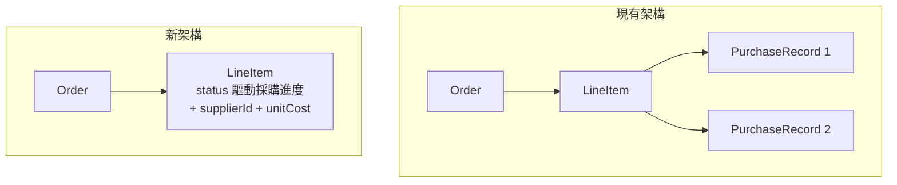
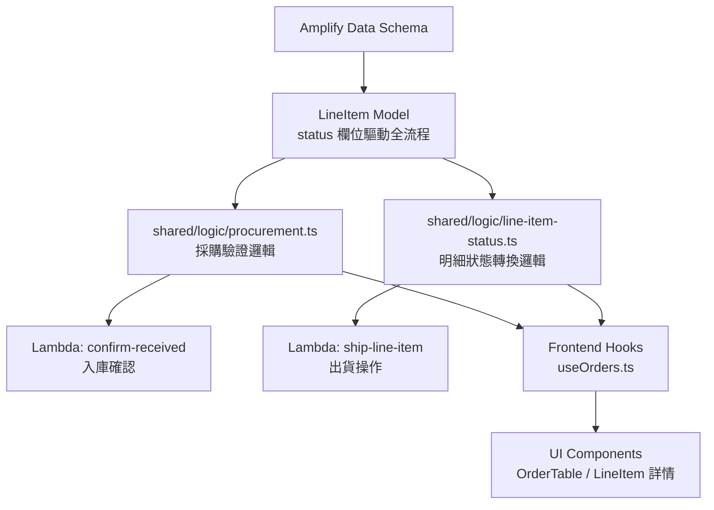
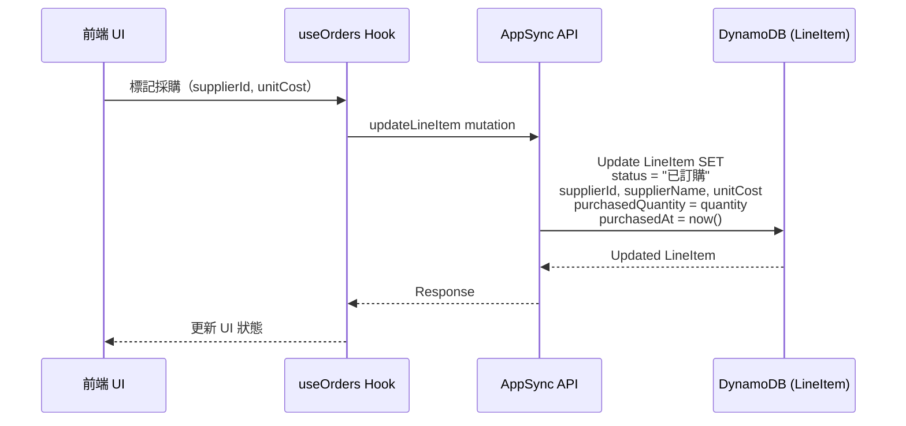
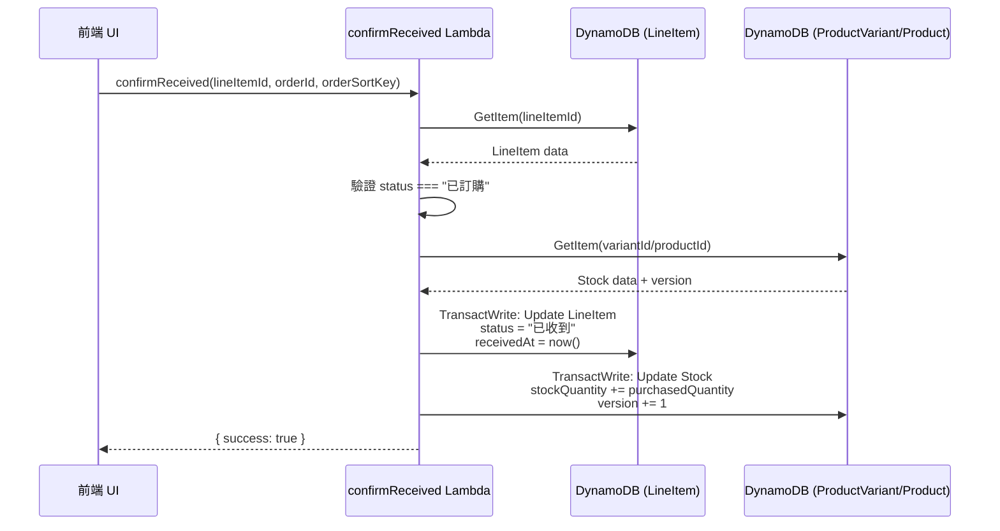

# 設計文件：LineItem 採購簡化（狀態標籤化）

## 概述

本設計旨在簡化現有的採購記錄架構，將獨立的 `PurchaseRecord` 模型移除，並將採購數量與成本的核心數據回歸到 `LineItem`（訂單明細）中。

核心設計決策：**不新增額外的 `procurementStatus` 欄位**，直接沿用現有的 `status` 欄位（待處理 → 已訂購 → 已收到 → 已出貨 / 缺貨）來表達採購進度。`status` 本身已能完整表達明細項目從採購到出貨的生命週期，只需在 LineItem 新增採購數據欄位（`supplierId`、`supplierName`、`unitCost`）即可。

此簡化的核心理念是：在目前的業務場景中，每筆明細項目對應一次採購行為（1:1 關係），不需要獨立的採購記錄實體來追蹤多次分批採購。透過將採購資訊內嵌至 LineItem，可以減少資料模型複雜度、降低 DynamoDB 跨表交易的成本，並簡化前端查詢邏輯。

## 架構

### 現有架構 vs 新架構



### 系統元件關係



## 序列圖

### 採購下單流程（簡化後）



### 入庫確認流程（簡化後）



## 元件與介面

### 元件 1：LineItem 資料模型（擴充）

**用途**：將採購相關欄位內嵌至 LineItem，取代獨立的 PurchaseRecord

**介面**：

```typescript
/** 明細項目狀態（不變） */
export type LineItemStatus = "待處理" | "已訂購" | "已收到" | "已出貨" | "缺貨";

/** 擴充後的明細項目 */
export interface LineItem {
  // --- 既有欄位 ---
  id: string;
  productId: string;
  productName: string;
  variantId: string | null;
  variantLabel: string | null;
  quantity: number;
  unitPrice: number;
  subtotal: number;
  status: LineItemStatus;
  purchasedQuantity: number;
  shippedQuantity: number;
  purchasedAt: string | null;   // 原 orderedAt，改名語意更明確
  receivedAt: string | null;
  shippedAt: string | null;

  // --- 新增：採購核心數據（原 PurchaseRecord 欄位） ---
  supplierId: string | null;
  supplierName: string | null;
  unitCost: number | null;

  // --- 移除：purchaseRecords (hasMany relationship) ---
}
```

**職責**：
- 完整表達明細項目的採購狀態與進度（透過 `status` 欄位）
- 記錄供應商與成本資訊
- `status` 欄位驅動 UI 顯示與操作按鈕

### 元件 2：採購驗證邏輯

**用途**：驗證採購下單與入庫確認的前置條件

**介面**：

```typescript
// shared/logic/procurement.ts

/**
 * 驗證採購下單操作的前置條件
 * - status 必須為「待處理」
 * - supplierId 非空
 * - unitCost >= 0
 */
export function validateProcurementOrder(
  lineItem: Pick<LineItem, "status" | "quantity">,
  supplierId: string,
  unitCost: number,
): ValidationResult;

/**
 * 驗證入庫確認操作的前置條件
 * - status 必須為「已訂購」
 * - purchasedQuantity > 0
 */
export function validateProcurementReceive(
  lineItem: Pick<LineItem, "status" | "purchasedQuantity">,
): ValidationResult;

/**
 * 驗證採購取消操作的前置條件
 * - status 必須為「待處理」或「已訂購」
 * - 已收到或已出貨的不可取消
 */
export function validateProcurementCancel(
  lineItem: Pick<LineItem, "status">,
): ValidationResult;

/**
 * 計算採購總成本
 */
export function calculateProcurementCost(
  purchasedQuantity: number,
  unitCost: number,
): number;
```

**職責**：
- 確保採購操作的前置條件滿足
- 提供前置條件驗證（供應商必填、成本 >= 0 等）
- 前端與 Lambda 共用同一份邏輯

### 元件 3：confirmReceived Lambda（簡化版）

**用途**：入庫確認操作，不再需要查詢 PurchaseRecord 表

**介面**：

```typescript
// 簡化後的 confirmReceived mutation 參數
interface ConfirmReceivedInput {
  lineItemId: string;
  orderId: string;
  orderSortKey: string;
}
```

**職責**：
- 驗證 LineItem 的 `status` 為「已訂購」
- 在單一交易中更新 LineItem 狀態與庫存
- 減少跨表查詢（不再需要 PurchaseRecord 表）

## 資料模型

### LineItem（擴充後）

```typescript
// Amplify Gen2 Schema 定義
LineItem: a.model({
  // --- 既有欄位 ---
  orderId: a.string().required(),
  orderSortKey: a.string().required(),
  order: a.belongsTo("Order", ["orderId", "orderSortKey"]),
  productId: a.string().required(),
  productName: a.string().required(),
  variantId: a.string(),
  variantLabel: a.string(),
  quantity: a.integer().required(),
  unitPrice: a.float().required(),
  subtotal: a.float().required(),
  status: a.string().required().default("待處理"),
  purchasedQuantity: a.integer().required().default(0),
  shippedQuantity: a.integer().required().default(0),

  // --- 既有欄位（重新命名）---
  purchasedAt: a.datetime(),       // 原 orderedAt，改名以語意更明確
  receivedAt: a.datetime(),
  shippedAt: a.datetime(),

  // --- 新增：採購核心數據 ---
  supplierId: a.string(),
  supplierName: a.string(),
  unitCost: a.float(),

  // --- 移除：purchaseRecords hasMany 關聯 ---
})
```

**驗證規則**：
- 當 `status` 為「已訂購」或之後的狀態時，`supplierId`、`supplierName`、`unitCost` 必須有值
- `unitCost` 必須 >= 0
- `purchasedQuantity` 在下單時設為 `quantity`（全量採購）

### status 欄位的語意對應

```typescript
/**
 * status 欄位在採購流程中的語意：
 *
 * | status   | 採購語意         | 可執行操作                |
 * |----------|-----------------|--------------------------|
 * | 待處理    | 尚未採購         | 標記採購、標記缺貨         |
 * | 已訂購    | 已向供應商下單    | 確認入庫、取消採購（→缺貨） |
 * | 已收到    | 已入庫           | 出貨                      |
 * | 已出貨    | 已完成出貨       | （終態）                   |
 * | 缺貨     | 採購取消/無法供貨  | （終態）                   |
 */
```

## 演算法虛擬碼

### 採購下單演算法

```typescript
/**
 * 採購下單操作
 *
 * 前置條件：
 * - lineItem.status === "待處理"
 * - supplierId 非空
 * - unitCost >= 0
 *
 * 後置條件：
 * - lineItem.status === "已訂購"
 * - lineItem.purchasedQuantity === lineItem.quantity
 * - lineItem.supplierId === supplierId
 * - lineItem.supplierName === supplierName
 * - lineItem.unitCost === unitCost
 * - lineItem.purchasedAt !== null
 */
function markAsProcured(
  lineItem: LineItem,
  supplierId: string,
  supplierName: string,
  unitCost: number,
): LineItem {
  // 驗證前置條件
  assert(lineItem.status === "待處理");
  assert(isValidLineItemStatusTransition("待處理", "已訂購"));
  assert(supplierId.length > 0);
  assert(unitCost >= 0);

  // 執行狀態轉換
  return {
    ...lineItem,
    status: "已訂購",
    purchasedQuantity: lineItem.quantity,
    supplierId,
    supplierName,
    unitCost,
    purchasedAt: new Date().toISOString(),
  };
}
```

### 入庫確認演算法

```typescript
/**
 * 入庫確認操作（Lambda TransactWriteItems）
 *
 * 前置條件：
 * - lineItem.status === "已訂購"
 * - stockVersion 與 DB 中一致（樂觀併發控制）
 *
 * 後置條件：
 * - lineItem.status === "已收到"
 * - lineItem.receivedAt !== null
 * - stock.stockQuantity += lineItem.purchasedQuantity
 * - stock.version += 1
 *
 * 迴圈不變式：N/A（單次交易操作）
 */
function confirmReceivedAlgorithm(lineItemId: string): TransactionResult {
  // Step 1: 讀取 LineItem
  const lineItem = getLineItem(lineItemId);
  assert(lineItem !== null);
  assert(lineItem.status === "已訂購");
  assert(isValidLineItemStatusTransition("已訂購", "已收到"));

  // Step 2: 讀取庫存
  const stock = getStock(lineItem.variantId ?? lineItem.productId);
  assert(stock !== null);
  const expectedVersion = stock.version;

  // Step 3: 建立交易
  const transaction = [
    // 更新 LineItem
    updateLineItem(lineItemId, {
      status: "已收到",
      receivedAt: now(),
    }),
    // 增加庫存（含版本檢查）
    updateStock(stock.id, {
      stockQuantity: stock.stockQuantity + lineItem.purchasedQuantity,
      version: expectedVersion + 1,
      condition: `version = ${expectedVersion}`,
    }),
  ];

  // Step 4: 執行交易
  return executeTransaction(transaction);
}
```

### 採購取消演算法

```typescript
/**
 * 採購取消操作
 *
 * 前置條件：
 * - lineItem.status === "待處理" 或 "已訂購"
 * - lineItem.status !== "已收到" 且 !== "已出貨"（已入庫不可取消）
 *
 * 後置條件：
 * - lineItem.status === "缺貨"
 * - lineItem.purchasedQuantity === 0（若原為已訂購則歸零）
 */
function cancelProcurement(lineItem: LineItem): LineItem {
  assert(lineItem.status === "待處理" || lineItem.status === "已訂購");
  assert(isValidLineItemStatusTransition(lineItem.status, "缺貨"));

  return {
    ...lineItem,
    status: "缺貨",
    purchasedQuantity: 0,
  };
}
```

## 關鍵函式與正式規格

### Function 1: validateProcurementOrder()

```typescript
function validateProcurementOrder(
  lineItem: Pick<LineItem, "status" | "quantity">,
  supplierId: string,
  unitCost: number,
): ValidationResult
```

**前置條件：**
- `lineItem` 非 null
- `supplierId` 為字串
- `unitCost` 為數值

**後置條件：**
- 回傳 `{ valid: true }` 若且唯若：
  - `lineItem.status === "待處理"`
  - `supplierId` 非空字串
  - `unitCost >= 0`
- 回傳 `{ valid: false, error: string }` 若任一條件不滿足
- 不修改輸入參數

**迴圈不變式：** N/A

### Function 2: validateProcurementReceive()

```typescript
function validateProcurementReceive(
  lineItem: Pick<LineItem, "status" | "purchasedQuantity">,
): ValidationResult
```

**前置條件：**
- `lineItem` 非 null

**後置條件：**
- 回傳 `{ valid: true }` 若且唯若：
  - `lineItem.status === "已訂購"`
  - `lineItem.purchasedQuantity > 0`
- 回傳 `{ valid: false, error: string }` 若任一條件不滿足
- 不修改輸入參數

**迴圈不變式：** N/A

### Function 3: calculateProcurementCost()

```typescript
function calculateProcurementCost(
  purchasedQuantity: number,
  unitCost: number,
): number
```

**前置條件：**
- `purchasedQuantity >= 0`
- `unitCost >= 0`

**後置條件：**
- 回傳 `purchasedQuantity * unitCost`
- 結果 >= 0

**迴圈不變式：** N/A

### Function 4: validateProcurementCancel()

```typescript
function validateProcurementCancel(
  lineItem: Pick<LineItem, "status">,
): ValidationResult
```

**前置條件：**
- `lineItem` 非 null

**後置條件：**
- 回傳 `{ valid: true }` 若且唯若：
  - `lineItem.status === "待處理"` 或 `lineItem.status === "已訂購"`
- 回傳 `{ valid: false, error: string }` 若 status 為「已收到」、「已出貨」或「缺貨」
- 不修改輸入參數

**迴圈不變式：** N/A

## 使用範例

```typescript
import {
  validateProcurementOrder,
  validateProcurementReceive,
  validateProcurementCancel,
  calculateProcurementCost,
} from "shared/logic/procurement";
import type { LineItem } from "shared/models/order";

// 範例 1：驗證採購下單
const lineItem: LineItem = {
  id: "li-001",
  status: "待處理",
  quantity: 10,
  purchasedQuantity: 0,
  supplierId: null,
  supplierName: null,
  unitCost: null,
  // ... 其他欄位
};

const validation = validateProcurementOrder(lineItem, "supplier-001", 50.0);
// validation = { valid: true }

// 範例 2：驗證入庫確認
const orderedItem: LineItem = {
  ...lineItem,
  status: "已訂購",
  purchasedQuantity: 10,
  supplierId: "supplier-001",
  supplierName: "供應商A",
  unitCost: 50.0,
};
const receiveValidation = validateProcurementReceive(orderedItem);
// receiveValidation = { valid: true }

// 範例 3：計算採購成本
const cost = calculateProcurementCost(10, 50.0);
// cost = 500.0

// 範例 4：前端 UI 操作按鈕邏輯
function getAvailableActions(lineItem: LineItem): string[] {
  const actions: string[] = [];
  if (lineItem.status === "待處理") {
    actions.push("標記採購", "標記缺貨");
  }
  if (lineItem.status === "已訂購") {
    actions.push("確認入庫", "取消採購");
  }
  if (lineItem.status === "已收到") {
    actions.push("出貨");
  }
  return actions;
}
```

## 正確性屬性

```typescript
import * as fc from "fast-check";

// Property 1: 狀態轉換的確定性
// ∀ from, to ∈ LineItemStatus:
//   isValidLineItemStatusTransition(from, to) 的結果是確定的（純函式）
fc.assert(
  fc.property(
    fc.constantFrom("待處理", "已訂購", "已收到", "已出貨", "缺貨"),
    fc.constantFrom("待處理", "已訂購", "已收到", "已出貨", "缺貨"),
    (from, to) => {
      const result1 = isValidLineItemStatusTransition(from, to);
      const result2 = isValidLineItemStatusTransition(from, to);
      return result1 === result2;
    }
  )
);

// Property 2: 終態不可轉出
// ∀ to ∈ LineItemStatus:
//   isValidLineItemStatusTransition("已出貨", to) === false
//   isValidLineItemStatusTransition("缺貨", to) === false
fc.assert(
  fc.property(
    fc.constantFrom("待處理", "已訂購", "已收到", "已出貨", "缺貨"),
    (to) => {
      return (
        isValidLineItemStatusTransition("已出貨", to) === false &&
        isValidLineItemStatusTransition("缺貨", to) === false
      );
    }
  )
);

// Property 3: 採購成本非負
// ∀ purchasedQuantity >= 0, unitCost >= 0:
//   calculateProcurementCost(purchasedQuantity, unitCost) >= 0
fc.assert(
  fc.property(
    fc.nat(),
    fc.float({ min: 0, noNaN: true }),
    (qty, cost) => {
      return calculateProcurementCost(qty, cost) >= 0;
    }
  )
);

// Property 4: 數量守恆
// ∀ lineItem 在採購下單後: lineItem.purchasedQuantity === lineItem.quantity

// Property 5: 採購下單驗證一致性
// ∀ lineItem where status !== "待處理":
//   validateProcurementOrder(lineItem, validSupplierId, validCost).valid === false
fc.assert(
  fc.property(
    fc.constantFrom("已訂購", "已收到", "已出貨", "缺貨"),
    fc.string({ minLength: 1 }),
    fc.float({ min: 0, noNaN: true }),
    (status, supplierId, unitCost) => {
      const lineItem = { status, quantity: 10 };
      return validateProcurementOrder(lineItem, supplierId, unitCost).valid === false;
    }
  )
);

// Property 6: 取消驗證一致性
// ∀ lineItem where status ∈ {"已收到", "已出貨", "缺貨"}:
//   validateProcurementCancel(lineItem).valid === false
fc.assert(
  fc.property(
    fc.constantFrom("已收到", "已出貨", "缺貨"),
    (status) => {
      return validateProcurementCancel({ status }).valid === false;
    }
  )
);
```

## 錯誤處理

### 錯誤場景 1：重複採購下單

**條件**：`status` 已為「已訂購」或之後狀態時嘗試再次下單
**回應**：回傳 `{ valid: false, error: "此明細項目已完成採購下單" }`
**恢復**：前端顯示錯誤訊息，不執行更新操作

### 錯誤場景 2：入庫確認時庫存版本衝突

**條件**：TransactWriteItems 的 ConditionExpression 失敗（version 不一致）
**回應**：回傳 `{ success: false, message: "庫存版本衝突，請重新取得最新資料後重試" }`
**恢復**：前端重新查詢最新資料，使用者可再次嘗試操作

### 錯誤場景 3：已入庫後嘗試取消

**條件**：`status` 為「已收到」或「已出貨」時嘗試取消
**回應**：回傳 `{ valid: false, error: "已入庫的明細項目無法取消採購" }`
**恢復**：前端隱藏取消按鈕（已收到/已出貨狀態下不顯示取消選項）

### 錯誤場景 4：供應商或成本資料缺失

**條件**：採購下單時 `supplierId` 為空或 `unitCost` 為負數
**回應**：回傳 `{ valid: false, error: "供應商為必填" }` 或 `{ valid: false, error: "單位成本不可為負數" }`
**恢復**：前端表單驗證阻止提交

## 測試策略

### 單元測試方法

- 測試 `validateProcurementOrder` 的各種邊界條件（status 不正確、supplierId 為空、unitCost 為負）
- 測試 `validateProcurementReceive` 的前置條件驗證
- 測試 `validateProcurementCancel` 的狀態限制
- 測試 `calculateProcurementCost` 的計算正確性
- 測試 `isValidLineItemStatusTransition` 的所有合法與非法轉換組合（既有測試需確認覆蓋）

### 屬性測試方法

**屬性測試庫**：fast-check

- 終態不可轉出屬性（Property 2）
- 採購成本非負屬性（Property 3）
- 採購下單驗證一致性（Property 5）
- 取消驗證一致性（Property 6）

### 整合測試方法

- 測試 `confirmReceived` Lambda 的完整交易流程（簡化版）
- 測試庫存版本衝突的重試機制
- 測試 `status` 轉換與採購數據欄位的一致性

## 效能考量

- **減少跨表查詢**：移除 PurchaseRecord 表後，入庫確認操作從 3 表交易（PurchaseRecord + LineItem + Stock）簡化為 2 表交易（LineItem + Stock）
- **減少 GSI 需求**：不再需要 PurchaseRecord 的 byLineItemId 索引
- **查詢簡化**：前端列表頁不再需要額外查詢 PurchaseRecord 來顯示採購狀態，直接從 LineItem 讀取 `status` 與採購欄位
- **DynamoDB 成本降低**：減少一個表的讀寫容量單位消耗

## 安全考量

- 所有採購操作仍需通過 Cognito 認證（`allow.authenticated()`）
- `confirmReceived` Lambda 使用 TransactWriteItems 確保原子性
- 庫存更新使用樂觀併發控制（version ConditionExpression）防止超賣
- 前端驗證與後端驗證雙重保障（shared/logic 純函式共用）

## 資料遷移策略

### 遷移步驟

1. **新增欄位**：在 LineItem 模型新增 `supplierId`、`supplierName`、`unitCost` 欄位；將 `orderedAt` 重新命名為 `purchasedAt`
2. **資料回填**：將現有 PurchaseRecord 的資料回填至對應的 LineItem
   - 複製 `PurchaseRecord.supplierId` → `LineItem.supplierId`
   - 複製 `PurchaseRecord.supplierName` → `LineItem.supplierName`
   - 複製 `PurchaseRecord.unitCost` → `LineItem.unitCost`
   - 無 PurchaseRecord 的 LineItem 保持 null
3. **更新 Lambda**：修改 `confirmReceived` 不再查詢 PurchaseRecord 表，直接操作 LineItem
4. **更新前端**：移除 PurchaseRecord 相關的查詢與 UI，改為直接操作 LineItem 欄位
5. **移除 PurchaseRecord**：確認所有功能正常後，從 schema 移除 PurchaseRecord 模型

### 向後相容

- 遷移期間保留 PurchaseRecord 表（唯讀），確保歷史資料可查
- 新的 `confirmReceived` mutation 參數簡化（移除 purchaseRecordId/purchaseRecordSortKey，改用 lineItemId + orderId + orderSortKey）
- 前端逐步切換至新的 API 介面

## 依賴

- **AWS Amplify Gen2**：資料模型定義與 AppSync API
- **@aws-sdk/client-dynamodb**：Lambda 中的 DynamoDB 操作
- **fast-check**：屬性測試
- **shared/logic/line-item-status.ts**：明細狀態轉換邏輯（不需變更，現有轉換路徑已支援）
- **shared/logic/order-status.ts**：訂單狀態推導邏輯（不需變更）
- **shared/logic/shipment.ts**：出貨驗證邏輯（不需變更）
