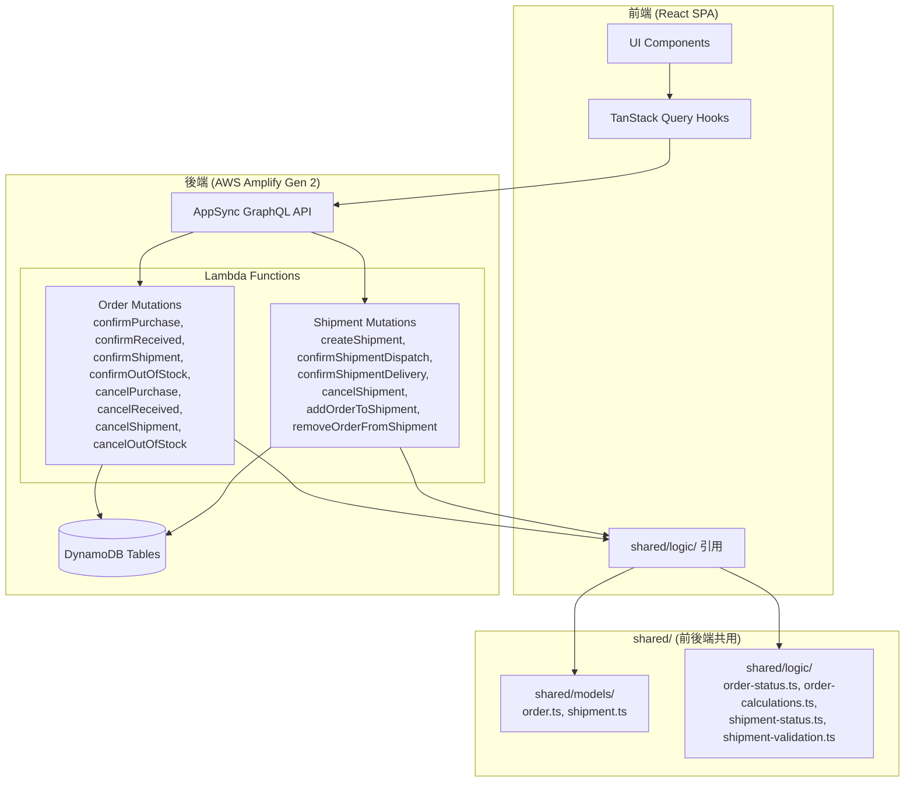
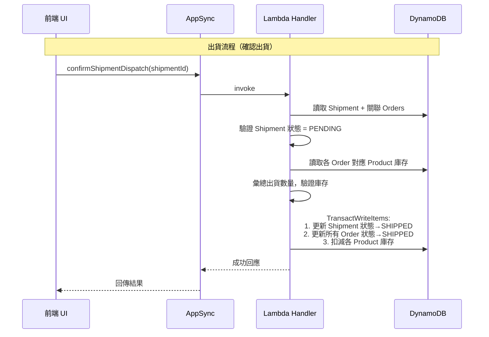
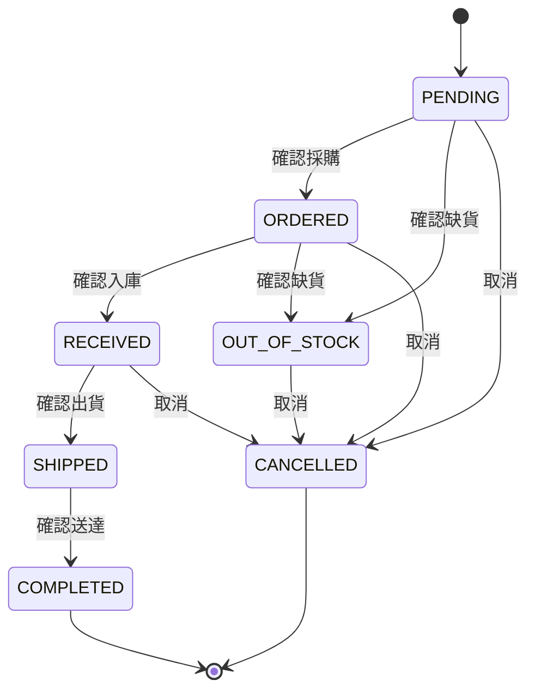
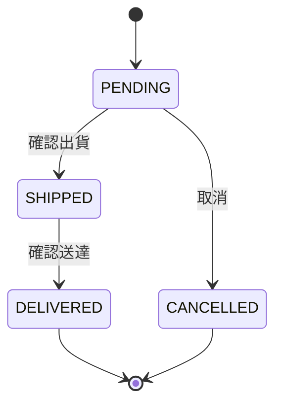

# Design Document

## Overview

本設計文件描述「訂單模型簡化」功能的技術架構。核心變更為：

1. **Order 模型扁平化**：將現有 `Order + OrderItem[]` 結構簡化為一筆 Order 即包含一個商品規格的完整資料（客戶快照、商品快照、金額、狀態）。
2. **移除 OrderItem 實體**：從 Amplify schema、Lambda handlers、shared logic 與 demo scripts 中完全移除 OrderItem。
3. **新增 Shipment 實體**：引入獨立的出貨單模型，支援多筆 Order 合併出貨，含獨立的狀態機與庫存驗證。
4. **狀態機重構**：Order 的 `status` 直接代表履約狀態（不再由 OrderItem 推導），Shipment 擁有獨立的 ShipmentStatus。

### 設計動機

- 現行 Order → OrderItem[] 結構在實際業務中每張訂單幾乎只有一筆明細，多對一關係增加了查詢複雜度與 Lambda 處理邏輯
- 出貨管理需要跨訂單合併，需要獨立的 Shipment 實體承載物流資訊
- 簡化後的 Order 可直接在列表頁顯示商品資訊，不需額外 join query

## Architecture

### 系統架構圖



### 資料流



## Components and Interfaces

### 1. Shared Models (`shared/models/`)

#### `shared/models/order.ts` — 重構

- 移除 `OrderItem` interface、`OrderItemStatus` 型別與相關常數
- 擴充 `Order` interface，整合原 OrderItem 欄位（商品快照、數量、金額、採購/入庫/出貨時間戳記）
- 新增 `OrderFulfillmentStatus` 型別（取代原 `OrderStatus`，狀態值相同但語意更明確）
- 更新 `CreateOrderInput` 為扁平結構（不再包含 `orderItems` 陣列）

#### `shared/models/shipment.ts` — 新增

- 定義 `ShipmentStatus` 型別：`PENDING | SHIPPED | DELIVERED | CANCELLED`
- 定義 `Shipment` interface
- 定義 `ShipmentOrderSummary` 用於查詢時的關聯 Order 摘要

### 2. Shared Logic (`shared/logic/`)

#### `shared/logic/order-status.ts` — 重構

- 重寫 `ALLOWED_TRANSITIONS` 為新的狀態機：
  - PENDING → ORDERED, OUT_OF_STOCK, CANCELLED
  - ORDERED → RECEIVED, OUT_OF_STOCK, CANCELLED
  - RECEIVED → SHIPPED, CANCELLED
  - SHIPPED → COMPLETED
  - OUT_OF_STOCK → CANCELLED
  - COMPLETED → (終態)
  - CANCELLED → (終態)
- 移除 `deriveOrderStatusFromOrderItems()`（不再需要推導）
- 保留 `isValidOrderStatusTransition()` 與 `getNextAllowedOrderStatuses()`

#### `shared/logic/order-item-status.ts` — 移除

- 整個檔案刪除，功能已整合至 Order 狀態機

#### `shared/logic/order-calculations.ts` — 重構

- 改為計算單筆 Order 的金額：
  - `calculateTotalPrice(quantity, unitPrice)` → totalPriceSnapshot
  - `calculateTotalCost(quantity, unitCost)` → totalCostSnapshot（null-safe）
  - `calculateTotalAmount(subtotal, shipping, discount)` → totalAmount
- 移除 `calculateOrderTotal(orderItems)`

#### `shared/logic/shipment-status.ts` — 新增

- 定義 Shipment 狀態轉換表
- `isValidShipmentStatusTransition(from, to): boolean`
- `getNextAllowedShipmentStatuses(current): ShipmentStatus[]`

#### `shared/logic/shipment-validation.ts` — 重構（取代現有 `shipment.ts`）

- `validateOrdersForShipment(orders)`: 驗證所有 Order 狀態為 RECEIVED
- `validateShipmentInventory(orders, products)`: 以 Product 層級彙總出貨數量並驗證庫存
- `validateOrderNotInActiveShipment(order)`: 驗證 Order 未關聯至未取消的 Shipment

#### `shared/logic/order-merge.ts` / `shared/logic/order-split.ts` — 移除

- 簡化模型後不再需要合併/分拆邏輯（一筆 Order = 一個商品）

### 3. Amplify Data Schema (`amplify/data/resource.ts`)

#### Order model — 重構

新增欄位（原 OrderItem 整合）：

- `productId`, `productNameSnapshot`, `productSkuSnapshot`, `productImageUrlSnapshot`
- `selectedOptionsSnapshot` (JSON)
- `quantity`, `unitPriceSnapshot`, `unitCostSnapshot`, `totalPriceSnapshot`, `totalCostSnapshot`
- `supplierName`, `purchasedAt`, `receivedAt`, `shippedAt`, `outOfStockAt`
- `shipmentId` (nullable, 關聯至 Shipment)

移除：

- `items: a.hasMany("OrderItem", "orderId")`

新增 GSI：

- `byStatus` — 依 `status` + `createdAtForSort` 排序（支援依狀態篩選）
- `byProductId` — 依 `productId` + `createdAtForSort`（支援依商品篩選）
- `byShipmentId` — 依 `shipmentId`（支援查詢 Shipment 下的 Orders）

#### OrderItem model — 移除

- 移除完整 model 定義、enum 引用、GSI

#### Shipment model — 新增

```
Shipment:
  shipmentNumber: string (required, unique)
  recipientName: string (required)
  recipientPhone: string
  recipientAddress: string
  status: ShipmentStatus (required, default PENDING)
  shippingMethod: string
  trackingNumber: string
  actualShippingCost: integer (default 0)
  shippedAt: datetime
  deliveredAt: datetime
  cancelledAt: datetime
  note: string
  gsiPartition / createdAtForSort (用於全域排序)
```

GSI：

- `byShipmentNumber` — 精確比對
- `byCreatedAt` — 全域排序（降冪）
- `byStatus` — 依狀態篩選

#### Custom Mutations — 重構

移除（不再需要 OrderItem-level 操作）：

- `mergeOrders`, `splitOrder`

重構（改為操作 Order 本身）：

- `confirmPurchase(orderId, supplierName)`
- `cancelPurchase(orderId)`
- `confirmReceived(orderId)`
- `cancelReceived(orderId)`
- `confirmShipment(orderId)` — 單筆 Order 直接出貨（無 Shipment 情境，保留向下相容）
- `cancelShipment(orderId)`
- `confirmOutOfStock(orderId)`
- `cancelOutOfStock(orderId)`

新增 Shipment mutations：

- `createShipment(input: CreateShipmentInput)` — 建立出貨單並關聯 Orders
- `confirmShipmentDispatch(shipmentId)` — 確認出貨（含庫存驗證與扣減）
- `confirmShipmentDelivery(shipmentId)` — 確認送達
- `cancelShipmentOrder(shipmentId)` — 取消出貨單
- `addOrderToShipment(shipmentId, orderId)` — 追加 Order 至 Shipment
- `removeOrderFromShipment(shipmentId, orderId)` — 從 Shipment 移除 Order

### 4. Lambda Functions (`amplify/functions/`)

#### 重構的 handlers

所有現有 `confirm-*` / `cancel-*` handlers 改為接受 `orderId` 參數（取代 `orderItemId`），直接操作 Order 的 status 欄位。

#### 新增的 handlers

| Function                     | 職責                                                                        |
| ---------------------------- | --------------------------------------------------------------------------- |
| `create-shipment`            | 建立 Shipment、驗證 Orders 狀態、設定關聯                                   |
| `confirm-shipment-dispatch`  | DynamoDB Transaction：驗證庫存→扣減庫存→更新 Shipment 狀態→更新 Orders 狀態 |
| `confirm-shipment-delivery`  | 更新 Shipment 為 DELIVERED、Orders 為 COMPLETED                             |
| `cancel-shipment-order`      | 取消 Shipment、回退 Orders 狀態、回補庫存（若已 SHIPPED）                   |
| `add-order-to-shipment`      | 驗證後追加 Order                                                            |
| `remove-order-from-shipment` | 驗證 Shipment 狀態為 PENDING 後移除 Order                                   |

#### 移除的 handlers

- `merge-orders/`
- `split-order/`

### 5. Demo Scripts (`scripts/`)

- `seed-demo-data.mjs`：移除 OrderItem 產生邏輯，改為直接建立扁平 Order + Shipment 假資料
- `clear-demo-data.mjs`：新增 Shipment 表清除，移除 OrderItem 表清除
- `rebuild-product-order-summaries.mjs`：改為掃描 Order 表
- `rebuild-supplier-order-summaries.mjs`：改為掃描 Order 表
- `rebuild-customer-order-summaries.mjs`：改為掃描 Order 表

## Data Models

### Order（簡化後）

| 欄位                    | 型別                   | 說明                                         |
| ----------------------- | ---------------------- | -------------------------------------------- |
| id                      | string                 | PK（自動產生）                               |
| orderNumber             | string                 | 格式 `ORD-YYYYMMDD-XXXX`，唯一               |
| customerId              | string                 | 客戶 ID                                      |
| customerNameSnapshot    | string                 | 客戶名稱快照                                 |
| customerPhoneSnapshot   | string?                | 客戶電話快照                                 |
| customerEmailSnapshot   | string?                | 客戶 Email 快照                              |
| shippingAddressSnapshot | string?                | 收件地址快照                                 |
| productId               | string                 | 商品 ID                                      |
| productNameSnapshot     | string                 | 商品名稱快照                                 |
| productSkuSnapshot      | string                 | 商品 SKU 快照                                |
| productImageUrlSnapshot | string?                | 商品圖片快照                                 |
| selectedOptionsSnapshot | JSON                   | 規格選取快照陣列                             |
| quantity                | integer                | 數量（1–9999）                               |
| unitPriceSnapshot       | integer                | 單價快照（0–999,999,999）                    |
| unitCostSnapshot        | integer?               | 單位成本快照（0–999,999,999）                |
| totalPriceSnapshot      | integer                | quantity × unitPriceSnapshot                 |
| totalCostSnapshot       | integer?               | quantity × unitCostSnapshot                  |
| subtotalAmount          | integer                | = totalPriceSnapshot                         |
| shippingAmount          | integer                | 運費（0–999,999,999）                        |
| discountAmount          | integer                | 折扣（0–999,999,999，≤ subtotal + shipping） |
| totalAmount             | integer                | subtotal + shipping - discount               |
| status                  | OrderFulfillmentStatus | 履約狀態                                     |
| paymentStatus           | PaymentStatus          | 付款狀態                                     |
| supplierName            | string?                | 供應商名稱                                   |
| purchasedAt             | datetime?              | 採購時間                                     |
| receivedAt              | datetime?              | 入庫時間                                     |
| shippedAt               | datetime?              | 出貨時間                                     |
| outOfStockAt            | datetime?              | 缺貨時間                                     |
| paidAt                  | datetime?              | 付款時間                                     |
| cancelledAt             | datetime?              | 取消時間                                     |
| refundedAt              | datetime?              | 退款時間                                     |
| completedAt             | datetime?              | 完成時間                                     |
| note                    | string?                | 備註（max 500）                              |
| statusHistory           | JSON                   | 狀態變更歷史陣列                             |
| shipmentId              | string?                | 關聯的 Shipment ID                           |
| isActive                | boolean                | 啟用旗標                                     |
| createdAt               | datetime               | 建立時間                                     |
| updatedAt               | datetime               | 更新時間                                     |

### OrderFulfillmentStatus 狀態機



### Shipment

| 欄位               | 型別           | 說明                      |
| ------------------ | -------------- | ------------------------- |
| id                 | string         | PK（自動產生）            |
| shipmentNumber     | string         | 遞增流水號，唯一          |
| recipientName      | string         | 收件人姓名（max 100）     |
| recipientPhone     | string?        | 收件人電話（max 30）      |
| recipientAddress   | string?        | 收件地址（max 200）       |
| status             | ShipmentStatus | 出貨狀態                  |
| shippingMethod     | string?        | 物流方式（max 50）        |
| trackingNumber     | string?        | 追蹤碼（max 100）         |
| actualShippingCost | integer        | 實際物流成本（0–999,999） |
| shippedAt          | datetime?      | 出貨時間                  |
| deliveredAt        | datetime?      | 送達時間                  |
| cancelledAt        | datetime?      | 取消時間                  |
| note               | string?        | 備註（max 500）           |
| createdAt          | datetime       | 建立時間                  |
| updatedAt          | datetime       | 更新時間                  |

### ShipmentStatus 狀態機



### Order ↔ Shipment 關聯

- Order.shipmentId → Shipment.id（多對一）
- 一筆 Order 最多關聯一筆未取消的 Shipment
- Shipment 下最多 50 筆 Order
- 透過 Order 的 `byShipmentId` GSI 反查

## Correctness Properties

_A property is a characteristic or behavior that should hold true across all valid executions of a system — essentially, a formal statement about what the system should do. Properties serve as the bridge between human-readable specifications and machine-verifiable correctness guarantees._

### Property 1: Order 欄位範圍驗證

_For any_ integer value, the Order validation function SHALL accept `quantity` if and only if the value is in the range [1, 9999], accept `unitPriceSnapshot` and `unitCostSnapshot` if and only if the value is in the range [0, 999,999,999], accept `shippingAmount` and `discountAmount` if and only if the value is in the range [0, 999,999,999], and reject with an error message containing the field name when any value is outside its allowed range. Additionally, `discountAmount` must not exceed `subtotalAmount + shippingAmount`.

**Validates: Requirements 1.2, 1.3, 1.7, 1.8**

### Property 2: Order 金額計算正確性

_For any_ valid quantity (1–9999) and valid unitPriceSnapshot (0–999,999,999), `totalPriceSnapshot` SHALL equal `quantity × unitPriceSnapshot`. _For any_ valid unitCostSnapshot, `totalCostSnapshot` SHALL equal `quantity × unitCostSnapshot`; when unitCostSnapshot is null, totalCostSnapshot SHALL be null. `subtotalAmount` SHALL equal `totalPriceSnapshot`, and `totalAmount` SHALL equal `subtotalAmount + shippingAmount - discountAmount`.

**Validates: Requirements 1.4, 1.5**

### Property 3: orderNumber 格式與唯一性

_For any_ invocation of the orderNumber generator, the result SHALL match the pattern `/^ORD-\d{8}-[A-Z0-9]{4}$/` where the 8 digits represent a valid YYYYMMDD date, and any two generated orderNumbers SHALL be distinct.

**Validates: Requirements 1.6**

### Property 4: Order 狀態機轉換完整性

_For any_ pair of OrderFulfillmentStatus values (from, to), `isValidOrderStatusTransition(from, to)` SHALL return true if and only if the pair is in the allowed set: {PENDING→ORDERED, PENDING→OUT_OF_STOCK, PENDING→CANCELLED, ORDERED→RECEIVED, ORDERED→OUT_OF_STOCK, ORDERED→CANCELLED, RECEIVED→SHIPPED, RECEIVED→CANCELLED, SHIPPED→COMPLETED, OUT_OF_STOCK→CANCELLED}. All other pairs SHALL return false.

**Validates: Requirements 3.2, 3.3, 3.4, 3.5, 3.6, 3.7, 3.8**

### Property 5: Order statusHistory 不可變追加

_For any_ successful Order status transition from state A to state B, the resulting statusHistory array SHALL contain all previous entries unchanged plus exactly one new entry with `fromStatus === A`, `toStatus === B`, and a valid ISO 8601 `changedAt` timestamp.

**Validates: Requirements 3.9**

### Property 6: Shipment 狀態機轉換完整性

_For any_ pair of ShipmentStatus values (from, to), `isValidShipmentStatusTransition(from, to)` SHALL return true if and only if the pair is in the allowed set: {PENDING→SHIPPED, PENDING→CANCELLED, SHIPPED→DELIVERED}. All other pairs SHALL return false.

**Validates: Requirements 5.2, 5.4, 5.6, 5.8**

### Property 7: Order 加入 Shipment 資格驗證

_For any_ Order, adding it to a Shipment SHALL succeed if and only if the Order's status is RECEIVED. For any Order with status ≠ RECEIVED, the operation SHALL be rejected with an error message containing the Order's orderNumber and current status.

**Validates: Requirements 4.5, 4.6**

### Property 8: Shipment-Order 狀態同步

_For any_ Shipment containing N orders (1 ≤ N ≤ 50): when the Shipment transitions to SHIPPED, all N associated Orders SHALL have status SHIPPED with non-null shippedAt; when the Shipment transitions to DELIVERED, all N Orders SHALL have status COMPLETED with non-null completedAt; when a PENDING Shipment is CANCELLED, all N Orders SHALL revert to status RECEIVED with shipmentId cleared.

**Validates: Requirements 5.3, 5.5, 5.7**

### Property 9: Order-Shipment 排他性關聯

_For any_ Order that is already associated with a non-cancelled Shipment (shipmentId is not null and that Shipment's status ≠ CANCELLED), attempting to add that Order to any other Shipment SHALL be rejected with an error message containing the Order's orderNumber and the existing Shipment's shipmentNumber.

**Validates: Requirements 6.4, 6.5**

### Property 10: Order 資料完整性於 Shipment 操作

_For any_ Order added to or removed from a Shipment, all Order fields except `shipmentId` SHALL remain unchanged. Specifically, when removing from a PENDING Shipment, `shipmentId` is cleared to null and `status` remains unchanged.

**Validates: Requirements 6.2, 6.6**

### Property 11: 非 PENDING Shipment 禁止移除 Order

_For any_ Shipment with status ≠ PENDING (i.e., SHIPPED, DELIVERED, or CANCELLED), attempting to remove an Order from that Shipment SHALL be rejected.

**Validates: Requirements 6.7**

### Property 12: Shipment 出貨庫存驗證

_For any_ set of Orders within a Shipment, grouping by productId and summing quantities, the shipment dispatch operation SHALL succeed if and only if every product's summed quantity ≤ that product's current stockQuantity. When any product's sum exceeds stock, the operation SHALL be rejected with an error listing each insufficient product's name, required quantity, and current stock.

**Validates: Requirements 7.1, 7.2**

### Property 13: Shipment 取消回補庫存

_For any_ SHIPPED Shipment that is cancelled, each product's stockQuantity SHALL increase by the total quantity of that product across all Orders in the Shipment. The net effect of ship-then-cancel on stockQuantity SHALL be zero (round-trip property).

**Validates: Requirements 7.4**

### Property 14: Shipment Order 數量邊界

_For any_ Shipment creation request, the operation SHALL accept 1 to 50 Orders (inclusive) and SHALL reject requests with 0 or more than 50 Orders.

**Validates: Requirements 4.4**

### Property 15: shipmentNumber 嚴格遞增

_For any_ sequence of Shipment creations, each generated shipmentNumber SHALL be strictly greater than all previously generated shipmentNumbers (monotonically increasing via SequenceCounter).

**Validates: Requirements 4.2**

## Error Handling

### Order 驗證錯誤

| 情境                                 | 錯誤訊息格式                                          | 處理方式                |
| ------------------------------------ | ----------------------------------------------------- | ----------------------- |
| quantity 超出範圍                    | `「數量」欄位值 {value} 超出允許範圍 (1–9999)`        | 拒絕建立/更新，回傳 400 |
| unitPriceSnapshot 超出範圍           | `「單價」欄位值 {value} 超出允許範圍 (0–999,999,999)` | 同上                    |
| discountAmount > subtotal + shipping | `「折扣金額」不得大於小計加運費之和`                  | 同上                    |
| 非法狀態轉換                         | `無法從狀態「{from}」轉換為「{to}」`                  | 拒絕操作，保留原狀態    |

### Shipment 驗證錯誤

| 情境                                    | 錯誤訊息格式                                                             | 處理方式           |
| --------------------------------------- | ------------------------------------------------------------------------ | ------------------ |
| Order 狀態非 RECEIVED                   | `訂單 {orderNumber} 目前狀態為「{status}」，無法加入出貨單`              | 拒絕加入           |
| Order 已關聯其他 Shipment               | `訂單 {orderNumber} 已關聯至出貨單 {shipmentNumber}，無法重複關聯`       | 拒絕加入           |
| 庫存不足                                | `庫存不足，無法出貨：{productName}（需要 {required}，目前庫存 {stock}）` | 拒絕出貨           |
| 非法 Shipment 狀態轉換                  | `無法從狀態「{from}」轉換為「{to}」`                                     | 拒絕操作           |
| 交易衝突 (TransactionCanceledException) | `資料已被其他操作變更，請重新取得最新資料後重試`                         | 回傳 409，提示重試 |
| Shipment 數量超限                       | `出貨單最多包含 50 筆訂單`                                               | 拒絕操作           |
| 非 PENDING 狀態移除 Order               | `出貨單狀態為「{status}」，無法移除訂單`                                 | 拒絕操作           |
| 建立時無 RECEIVED Order                 | `建立出貨單需至少包含一筆狀態為「已到貨」的訂單`                         | 拒絕建立           |

### 前端錯誤處理模式

- 所有 mutation 錯誤透過 TanStack Query 的 `onError` callback 處理
- 錯誤訊息以 MUI Snackbar 或 Alert 顯示繁體中文文案
- 交易衝突（409）時自動 invalidate 相關 query 並提示使用者重試

## Testing Strategy

### 屬性測試 (Property-Based Testing)

使用 `fast-check` 搭配 `vitest`，針對 `shared/logic/` 中的純函式邏輯撰寫屬性測試。

**測試檔案位置**：

- `shared/logic/__tests__/order-status.property.test.ts`
- `shared/logic/__tests__/order-calculations.property.test.ts`
- `shared/logic/__tests__/shipment-status.property.test.ts`
- `shared/logic/__tests__/shipment-validation.property.test.ts`

**配置**：

- 每個屬性測試至少 100 次迭代
- 每個測試標註對應的 Design Property 編號
- 標記格式：`// Feature: order-model-simplification, Property {N}: {description}`

**涵蓋的 Properties**：

- Property 1–5：Order 驗證與計算邏輯
- Property 6–8：Shipment 狀態機與同步邏輯
- Property 9–15：Shipment-Order 關聯規則與庫存驗證

### 單元測試 (Example-Based Unit Tests)

使用 `vitest` 撰寫針對具體情境的測試：

- `shared/logic/__tests__/order-status.test.ts` — 具體狀態轉換場景
- `shared/logic/__tests__/shipment-validation.test.ts` — 邊界條件（0 筆 Order、51 筆 Order）
- `shared/logic/__tests__/order-calculations.test.ts` — null handling、溢位邊界

### 整合測試

Lambda handler 層級的測試，使用 mock DynamoDB client：

- 確認出貨交易的原子性（TransactWriteItems mock）
- 交易衝突（TransactionCanceledException）的錯誤處理
- 查詢分頁與 GSI 篩選行為

### 測試執行

```bash
# 執行所有測試（含屬性測試）
npm run test -- --silent

# 執行特定模組
npm run test -- --silent --grep "order-status"

# 僅執行屬性測試
npm run test -- --silent --grep "property"
```
