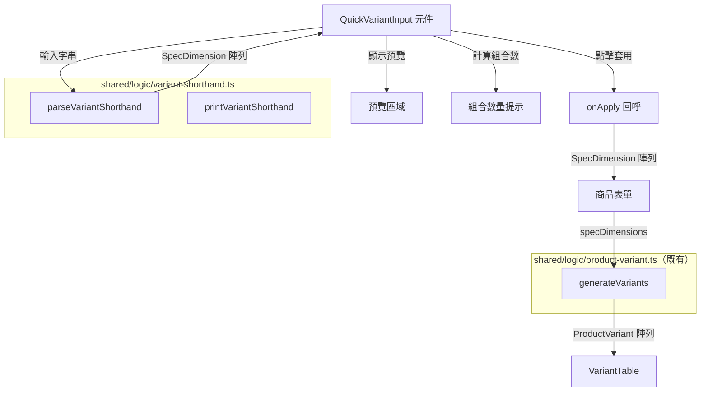
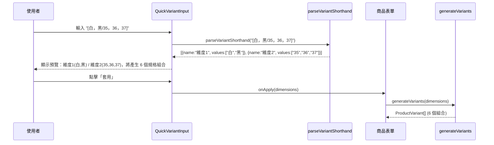

# 設計文件：快速規格輸入（Quick Variant Input）

## 概述

本功能為商品新增/編輯頁面加入「快速規格輸入」元件，讓使用者以簡寫語法（如 `[白，黑/35，36，37，38，39，40]`）一次定義多組規格維度。系統解析輸入後產生 `SpecDimension[]`，再透過既有的 `generateVariants()` 笛卡爾積邏輯自動產生所有規格組合。

### 設計目標

1. **解析器為純函式**：放置於 `shared/logic/`，無副作用，前端與 Lambda 共用。
2. **往返正確性**：`parse(print(x))` 產生等價結果，確保資料轉換不遺失。
3. **即時預覽**：使用者輸入時即時顯示解析結果與組合數量。
4. **安全整合**：套用前檢查既有規格組合，必要時顯示確認對話框。

### 設計決策

| 決策       | 選擇                                | 理由                                       |
| ---------- | ----------------------------------- | ------------------------------------------ |
| 解析器位置 | `shared/logic/variant-shorthand.ts` | 與 `product-variant.ts` 同層，純函式可共用 |
| 分隔符     | `/` 分維度，`，` 或 `,` 分值        | 符合使用者習慣，支援全形/半形逗號          |
| 維度命名   | 自動產生 `維度1`、`維度2`...        | 簡寫語法不含維度名稱，自動命名最簡潔       |
| 組合上限   | 100                                 | 避免產生過多組合影響效能與使用體驗         |
| UI 元件    | 獨立 `QuickVariantInput` 元件       | 可重用於新增/編輯頁面                      |

## 架構



### 模組分層

| 層級       | 模組                                            | 職責                           |
| ---------- | ----------------------------------------------- | ------------------------------ |
| 純函式層   | `shared/logic/variant-shorthand.ts`             | 解析（parse）與格式化（print） |
| UI 元件層  | `src/components/QuickVariantInput.tsx`          | 輸入欄位、即時預覽、套用按鈕   |
| 頁面整合層 | `src/routes/products/new.tsx`、`$productId.tsx` | 將元件嵌入表單，處理套用邏輯   |

## 元件與介面

### 1. 解析器模組：`shared/logic/variant-shorthand.ts`

```typescript
import type { SpecDimension } from "../models/product";

/**
 * 解析簡寫語法字串為 SpecDimension 陣列。
 *
 * 語法規則：
 * - 以 `[` 和 `]` 包裹（可選）
 * - 以 `/` 分隔不同維度群組
 * - 以全形逗號 `，` 或半形逗號 `,` 分隔同一維度內的選項值
 * - 自動去除前後空白
 * - 自動移除同一維度內重複值（保留首次出現順序）
 * - 自動產生維度名稱：維度1、維度2、維度3...
 *
 * @param input - 簡寫語法字串
 * @returns 解析後的 SpecDimension 陣列（空輸入回傳空陣列）
 */
export function parseVariantShorthand(input: string): SpecDimension[];

/**
 * 將 SpecDimension 陣列格式化為簡寫語法字串。
 *
 * 格式：[值1，值2/值3，值4，值5]
 * - 以 `/` 分隔不同維度
 * - 以 `，` 分隔同一維度內的值
 * - 以 `[]` 包裹
 *
 * @param dimensions - SpecDimension 陣列
 * @returns 格式化後的簡寫語法字串（空陣列回傳空字串）
 */
export function printVariantShorthand(dimensions: SpecDimension[]): string;

/**
 * 計算 SpecDimension 陣列的笛卡爾積組合數量。
 *
 * @param dimensions - SpecDimension 陣列
 * @returns 組合數量（空陣列或任一維度為空時回傳 0）
 */
export function countCombinations(dimensions: SpecDimension[]): number;
```

### 2. UI 元件：`src/components/QuickVariantInput.tsx`

```typescript
import type { SpecDimension } from "../../shared/models/product";

export interface QuickVariantInputProps {
  /** 套用回呼，傳入解析後的 SpecDimension 陣列 */
  onApply: (dimensions: SpecDimension[]) => void;
  /** 是否有既有規格組合（用於決定是否顯示確認對話框） */
  hasExistingVariants?: boolean;
  /** 是否停用（唯讀模式時隱藏） */
  disabled?: boolean;
}
```

**元件行為：**

1. 渲染一個 MUI TextField，標籤為「快速規格輸入」，佔位文字為 `例：白，黑/35，36，37，38，39，40`
2. 使用者輸入時即時呼叫 `parseVariantShorthand()` 解析
3. 解析結果非空時，在輸入欄位下方顯示：
   - 各維度群組的預覽（以 Chip 顯示各值）
   - 組合數量提示（如「將產生 12 個規格組合」）
4. 組合數 ≤ 100 時顯示「套用」按鈕；超過 100 時停用按鈕並以 error 色彩顯示警告
5. 點擊「套用」時：
   - 若 `hasExistingVariants` 為 true，先顯示 ConfirmDialog 確認
   - 確認後呼叫 `onApply(dimensions)`

### 3. 確認對話框整合

使用既有的 `src/components/ConfirmDialog.tsx`，訊息為：

> 套用新的規格維度將取代所有既有規格組合（包含庫存與價格設定）。確定要繼續嗎？

## 資料模型

本功能不新增資料模型，完全複用既有的 `SpecDimension` 與 `ProductVariant` 介面。

### 資料流



### 解析器演算法

```
parseVariantShorthand(input):
  1. 去除前後空白
  2. 若為空字串，回傳 []
  3. 去除外層方括號（若有）
  4. 以 "/" 分割為維度群組字串陣列
  5. 對每個群組字串：
     a. 以正則 /[，,]/ 分割為值陣列
     b. 對每個值去除前後空白
     c. 過濾空字串
     d. 去除重複值（保留首次出現順序）
     e. 若結果非空，建立 SpecDimension { name: "維度{n}", values }
  6. 回傳非空維度的 SpecDimension 陣列
```

## 正確性屬性

_屬性是指在系統所有有效執行中都應成立的特徵或行為——本質上是對系統應做什麼的形式化陳述。屬性是人類可讀規格與機器可驗證正確性保證之間的橋樑。_

### 屬性 1：往返 — 格式化後再解析保留維度

_對任何_ 有效的 `SpecDimension[]` 陣列（每個維度有非空名稱與非空 values 陣列，且值不包含 `/`、`，`、`,`），`parseVariantShorthand(printVariantShorthand(dims))` 應產生具有等價 `values` 陣列（相同元素、相同順序）的 `SpecDimension[]`。

**驗證：需求 3.1、3.2、6.2**

### 屬性 2：穩定化 — parse-print-parse 等於 parse

_對任何_ 輸入字串，`parseVariantShorthand(printVariantShorthand(parseVariantShorthand(input)))` 應產生與 `parseVariantShorthand(input)` 相同 `values` 陣列的結果。

**驗證：需求 6.1**

### 屬性 3：解析後的值已去除空白

_對任何_ 包含前後空白值的輸入字串，解析結果中每個維度的每個值都不應有前導或尾隨空白字元。

**驗證：需求 1.5**

### 屬性 4：每個維度內的值唯一

_對任何_ 輸入字串，解析結果中每個維度不應包含重複值（同一維度內所有值皆不重複）。

**驗證：需求 1.6**

### 屬性 5：維度命名遵循順序模式

_對任何_ 產生 N 個維度（N ≥ 1）的輸入字串，維度名稱應依序為 `維度1`、`維度2`、...、`維度N`。

**驗證：需求 1.7**

### 屬性 6：方括號為可選且不影響結果

_對任何_ 不包含 `[` 或 `]` 的內容字串，`parseVariantShorthand("[" + content + "]")` 應產生與 `parseVariantShorthand(content)` 相同的結果。

**驗證：需求 1.3、1.4**

### 屬性 7：全形與半形逗號為等價分隔符

_對任何_ 維度群組內的值集合，以 `，`（全形）或 `,`（半形）連接後解析應產生相同的 values 陣列。

**驗證：需求 1.2**

### 屬性 8：結果中僅包含非空維度

_對任何_ 輸入字串，解析結果中每個維度至少有一個值（輸出中不存在空維度），且純空白或空輸入產生空陣列。

**驗證：需求 2.1、2.2、2.3**

### 屬性 9：組合數等於各維度大小的乘積

_對任何_ `SpecDimension[]` 陣列，`countCombinations(dims)` 應等於所有維度 `dim.values.length` 的乘積（若陣列為空或任一維度有零個值則回傳 0）。

**驗證：需求 4.6**

## 錯誤處理

### 解析器錯誤處理

解析器設計為**寬容解析**（lenient parsing），不拋出例外：

| 情境                          | 行為                               |
| ----------------------------- | ---------------------------------- |
| 空字串 / 純空白               | 回傳 `[]`                          |
| 空維度群組（如 `白，黑//35`） | 跳過空群組，僅保留有效群組         |
| 所有群組皆為空                | 回傳 `[]`                          |
| 值包含特殊字元                | 視為合法值（不做額外驗證）         |
| 極長輸入                      | 正常解析（組合數檢查由 UI 層處理） |

### UI 層錯誤處理

| 情境                 | 行為                                      |
| -------------------- | ----------------------------------------- |
| 組合數 > 100         | 停用「套用」按鈕，顯示 error 色彩警告文字 |
| 解析結果為空         | 隱藏預覽區域與「套用」按鈕                |
| 套用時有既有規格組合 | 顯示 ConfirmDialog，取消則不執行          |

## 測試策略

### 屬性測試（Property-Based Testing）

本功能的核心為純函式解析器與格式化器，非常適合屬性測試。使用 **fast-check** 函式庫，每個屬性至少 100 次迭代。

**測試檔案**：`shared/logic/__tests__/variant-shorthand.property.test.ts`

每個屬性測試以註解標記對應的設計文件屬性：

```typescript
// Feature: quick-variant-input, Property 1: Round-trip — print then parse preserves dimensions
```

**Arbitrary 設計**：

- `validValueArb`：產生不含 `/`、`，`、`,`、`[`、`]` 的非空字串（避免與分隔符衝突）
- `specDimensionArb`：產生含 1~5 個唯一值的 SpecDimension
- `specDimensionsArb`：產生 1~4 組 SpecDimension
- `shorthandInputArb`：產生有效的簡寫語法字串（含隨機空白、隨機逗號類型）
- `whitespaceArb`：產生純空白字串

### 單元測試（Example-Based）

**測試檔案**：`shared/logic/__tests__/variant-shorthand.test.ts`

覆蓋具體範例與邊界情況：

- 基本解析：`[白，黑/35，36，37]` → 2 個維度
- 單一維度：`白，黑，灰` → 1 個維度
- 混合逗號：`白,黑，灰` → 正確解析
- 重複值移除：`白，黑，白` → `["白", "黑"]`
- 空白處理：`[ 白 ， 黑 ]` → `["白", "黑"]`
- 空輸入：`""`, `"   "`, `"[]"` → `[]`
- 格式化輸出：驗證 `printVariantShorthand` 產生正確格式

### 元件測試

**測試檔案**：`src/components/__tests__/QuickVariantInput.test.tsx`

使用 React Testing Library：

- 渲染驗證：標籤、佔位文字
- 即時預覽：輸入後顯示維度預覽
- 組合數顯示：正確計算並顯示
- 套用按鈕：有效時啟用，超過 100 時停用
- 確認對話框：有既有規格組合時顯示
- 回呼觸發：套用後正確呼叫 onApply

### 測試配置

```typescript
// vitest 屬性測試配置
fc.assert(fc.property(...), { numRuns: 200 });
```
