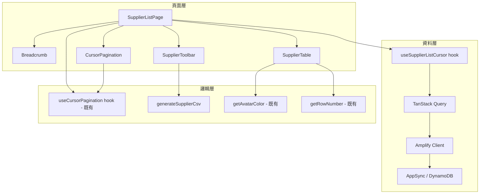
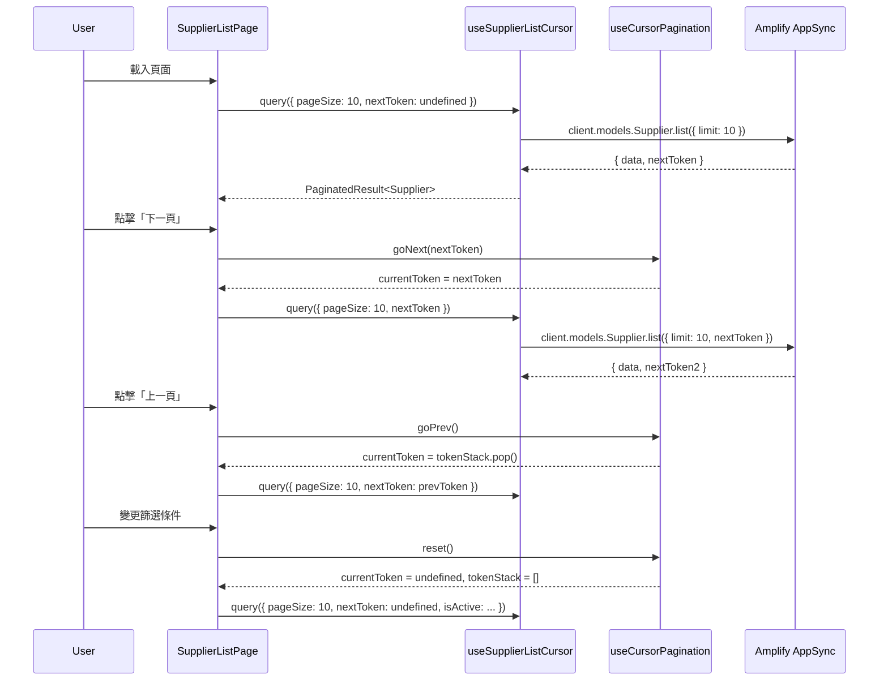

# 設計文件：供應商列表 UI 重構

## 概述

本設計文件描述供應商列表頁面的 UI 重構方案，將現有使用共用 `DataTable` 元件的供應商列表頁面升級為獨立的 TanStack Table + MUI Table 實作。重構涵蓋工具列整合、複合欄位、游標式分頁、批次選取、行操作按鈕及 CSV 匯出功能。

本設計以已完成的客戶列表頁面重構為參考，複用相同的架構模式與共用工具函式，確保兩個列表頁面的使用者體驗一致。

核心設計原則：

- **模式複用**：沿用客戶列表的架構模式（游標分頁 hook、工具列元件、行操作元件）
- **共用工具函式**：複用 `getAvatarColor`、`getAvatarLetter`、`getRowNumber` 等既有純函式
- **向後相容**：共用 `DataTable` 元件不做修改，供應商列表頁面使用獨立的表格實作
- **游標式分頁**：複用既有 `useCursorPagination` hook，以 DynamoDB `nextToken` 為基礎
- **純函式可測試**：新增 `supplier-csv.ts` 模組，將 CSV 產生邏輯抽離為純函式

## 架構



### 架構決策

1. **不修改共用 DataTable**：供應商列表頁面直接使用 TanStack Table + MUI Table 元件組合，避免影響其他使用 `DataTable` 的頁面。共用 `DataTable` 使用 offset-based 分頁（`TablePagination`），與游標式分頁不相容。

2. **複用既有 `useCursorPagination` hook**：不重新建立分頁邏輯，直接引用 `src/hooks/useCursorPagination.ts`，該 hook 已封裝完整的 token 堆疊管理。

3. **複用既有工具函式**：`getAvatarColor`、`getAvatarLetter`（`src/lib/avatar-utils.ts`）及 `getRowNumber`（`src/lib/table-utils.ts`）已在客戶列表中驗證，直接複用。

4. **新增供應商專用 CSV 模組**：建立 `src/lib/supplier-csv.ts`，結構與 `customer-csv.ts` 一致，但欄位對應供應商模型。

5. **元件放置於 `-components` 目錄**：遵循 TanStack Router 的路由目錄慣例，供應商列表的子元件放置於 `src/routes/suppliers/-components/`（`-` 前綴表示非路由目錄）。

## 元件與介面

### 新增元件

#### `SupplierToolbar`（`src/routes/suppliers/-components/SupplierToolbar.tsx`）

```typescript
interface SupplierToolbarProps {
  search: string;
  onSearchChange: (value: string) => void;
  totalCount: number;
  statusFilter: StatusFilter;
  onStatusFilterChange: (value: StatusFilter) => void;
  sortField: SupplierSortField;
  onSortFieldChange: (value: SupplierSortField) => void;
  onAddClick: () => void;
  onExportClick: () => void;
  isExporting: boolean;
}

type StatusFilter = "all" | "active" | "inactive";
type SupplierSortField = "name" | "contactPerson" | "phone" | "createdAt";
```

水平排列：搜尋輸入框（含 `搜尋 {N} 筆記錄...` 佔位文字、300ms 防抖）→ Status_Filter（MUI Select：全部狀態/啟用中/已停用）→ Sort_Dropdown（MUI Select：供應商名稱/聯絡人/電話/建立日期）→ 新增供應商按鈕（primary + AddIcon）→ CSV 匯出 IconButton（FileDownloadIcon，匯出中顯示 CircularProgress）

#### `SupplierInfoCell`（`src/routes/suppliers/-components/SupplierInfoCell.tsx`）

```typescript
interface SupplierInfoCellProps {
  name: string;
  contactPerson: string;
}
```

渲染結構：`Avatar`（左側，使用 `getAvatarLetter` + `getAvatarColor`）+ `Box`（右側，包含 name Typography subtitle2 粗體 + contactPerson Typography body2 次要色彩）

#### `SupplierRowActions`（`src/routes/suppliers/-components/SupplierRowActions.tsx`）

```typescript
interface SupplierRowActionsProps {
  supplier: Supplier;
  onView: (supplier: Supplier) => void;
  onEdit: (supplier: Supplier) => void;
  onToggleActive: (supplier: Supplier) => void;
}
```

顯示三個 IconButton：檢視（VisibilityIcon）、編輯（EditIcon）、啟用/停用（啟用中顯示 BlockIcon warning 色彩，已停用顯示 CheckCircleIcon success 色彩）

#### `CursorPagination`（`src/routes/suppliers/-components/CursorPagination.tsx`）

```typescript
interface CursorPaginationProps {
  pageSize: number;
  onPageSizeChange: (size: number) => void;
  hasNextPage: boolean;
  hasPrevPage: boolean;
  onNextPage: () => void;
  onPrevPage: () => void;
  currentCount: number;
}
```

與客戶列表的 `CursorPagination` 結構相同。顯示「每頁筆數」下拉選單（10/25/50）、「顯示 {count} 筆」文字、上一頁/下一頁按鈕。

### 新增 Hooks

#### `useSupplierListCursor`（`src/hooks/useSupplierListCursor.ts`）

```typescript
interface SupplierListCursorParams {
  pageSize: number;
  nextToken?: string;
  search?: string;
  isActive?: boolean;
  sortField?: SupplierSortField;
}

function useSupplierListCursor(
  params: SupplierListCursorParams,
): UseQueryResult<PaginatedResult<Supplier>>;
```

使用 TanStack Query 的 `useQuery`，query key 包含所有參數。呼叫 `client.models.Supplier.list` 並傳入 `limit`、`nextToken`、`filter`。支援 `search`（name/contactPerson/phone 模糊搜尋）與 `isActive` 篩選。客戶端依 `sortField` 排序。

### 複用既有 Hooks

#### `useCursorPagination`（`src/hooks/useCursorPagination.ts`）

已存在，直接引用。管理 `currentToken`、`pageSize`、`tokenStack` 狀態，提供 `goNext`、`goPrev`、`setPageSize`、`reset` 操作。

### 純函式模組

#### `src/lib/supplier-csv.ts`（新增）

```typescript
/** 產生供應商列表 CSV 字串（含 UTF-8 BOM） */
function generateSupplierCsv(suppliers: Supplier[]): string;

/** 產生 CSV 檔案名稱 */
function getSupplierCsvFilename(date?: Date): string;
```

CSV 標題列：供應商名稱、聯絡人、電話、Email、地址、狀態、建立日期。欄位值中的逗號與換行以雙引號包裹處理。

#### `src/lib/avatar-utils.ts`（既有，複用）

```typescript
function getAvatarColor(name: string): string;
function getAvatarLetter(name: string): string;
```

#### `src/lib/table-utils.ts`（既有，複用）

```typescript
function getRowNumber(page: number, pageSize: number, rowIndex: number): number;
```

## 資料模型

### 現有模型（無需修改）

```typescript
// shared/models/supplier.ts
interface Supplier {
  id: string;
  name: string;
  contactPerson: string;
  phone: string;
  email: string;
  address: string;
  isActive: boolean;
  createdAt: string;
  updatedAt: string;
}

// shared/models/order.ts (PaginatedResult)
interface PaginatedResult<T> {
  items: T[];
  totalCount: number;
  nextToken?: string;
}
```

### 新增型別

```typescript
// 供應商排序欄位
type SupplierSortField = "name" | "contactPerson" | "phone" | "createdAt";

// 狀態篩選（與客戶列表共用型別）
type StatusFilter = "all" | "active" | "inactive";
```

### 資料流



## 正確性屬性

_屬性（Property）是一種在系統所有有效執行中都應成立的特徵或行為——本質上是對系統應做什麼的形式化陳述。屬性作為人類可讀規格與機器可驗證正確性保證之間的橋樑。_

### 屬性 1：列號計算正確性

_對於任意_ 有效的頁碼（page ≥ 0）、每頁筆數（pageSize > 0）及列索引（rowIndex ≥ 0），`getRowNumber(page, pageSize, rowIndex)` 應回傳 `page × pageSize + rowIndex + 1`，且結果始終為正整數。

**驗證：需求 3.2**

### 屬性 2：Avatar 衍生一致性

_對於任意_ 非空字串 name，`getAvatarLetter(name)` 應回傳 name 的第一個字元，且 `getAvatarColor(name)` 對相同輸入始終回傳相同的有效十六進位色彩值（格式 `#RRGGBB`）。

**驗證：需求 2.3, 2.4**

### 屬性 3：選取狀態一致性

_對於任意_ 列集合與選取操作序列：

- 點擊全選後，所有列的選取狀態應為 true
- 點擊單列核取方塊應僅切換該列的選取狀態
- 當 0 < 已選取數 < 總列數時，標題核取方塊應為不確定狀態

**驗證：需求 5.1, 5.2, 5.4**

### 屬性 4：Token 堆疊行為

_對於任意_ 前進導覽序列（goNext 呼叫 n 次），token 堆疊長度應等於 n，且連續呼叫 goPrev 應以 LIFO 順序回傳先前的 token。當呼叫 reset 時，無論先前狀態為何，token 堆疊應清空且 currentToken 應為 undefined。

**驗證：需求 6.4, 6.5, 6.6**

### 屬性 5：CSV 匯出正確性

_對於任意_ 供應商陣列，`generateSupplierCsv(suppliers)` 應產生：

- 以 UTF-8 BOM（`\uFEFF`）開頭的字串
- 包含標題列（供應商名稱、聯絡人、電話、Email、地址、狀態、建立日期）
- 資料列數等於輸入供應商數量
- 每列包含該供應商的所有對應欄位值

**驗證：需求 7.1, 7.2, 7.3**

### 屬性 6：排序產生有序輸出

_對於任意_ 供應商陣列與排序欄位，依該欄位排序後的結果應滿足：對於所有相鄰元素 (a, b)，`a[field] <= b[field]`（依字串比較）。

**驗證：需求 1.6, 9.5**

## 錯誤處理

| 情境                       | 處理方式                                             |
| -------------------------- | ---------------------------------------------------- |
| API 查詢失敗               | 顯示 MUI Alert（error severity），保留上次成功的資料 |
| 停用/啟用操作失敗          | 關閉確認對話框，顯示錯誤 Alert                       |
| CSV 匯出失敗（資料為空）   | 顯示提示 Alert（info severity）「目前無資料可匯出」  |
| nextToken 無效（後端錯誤） | 重置分頁狀態，從第一頁重新載入                       |
| 網路斷線                   | TanStack Query 自動重試（預設 3 次），失敗後顯示錯誤 |

## 測試策略

### 屬性測試（Property-Based Testing）

使用 **fast-check** 函式庫，每個屬性至少 100 次迭代。

| 屬性                | 測試檔案                                                   | 說明                                      |
| ------------------- | ---------------------------------------------------------- | ----------------------------------------- |
| 屬性 1：列號計算    | `src/lib/__tests__/table-utils.property.test.ts`           | 既有測試，產生隨機 page/pageSize/rowIndex |
| 屬性 2：Avatar 衍生 | `src/lib/__tests__/avatar-utils.property.test.ts`          | 既有測試，產生隨機中英文字串              |
| 屬性 3：選取狀態    | `src/hooks/__tests__/useSelection.property.test.ts`        | 既有測試，產生隨機選取操作序列            |
| 屬性 4：Token 堆疊  | `src/hooks/__tests__/useCursorPagination.property.test.ts` | 既有測試，產生隨機導覽序列                |
| 屬性 5：CSV 匯出    | `src/lib/__tests__/supplier-csv.property.test.ts`          | 新增，產生隨機供應商資料（含特殊字元）    |
| 屬性 6：排序        | `src/lib/__tests__/supplier-sort.property.test.ts`         | 新增，產生隨機供應商陣列與排序欄位        |

每個測試標記格式：`Feature: supplier-list-ui-refinement, Property {N}: {描述}`

### 單元測試（Example-Based）

| 測試目標              | 測試檔案                                                     | 涵蓋需求                     |
| --------------------- | ------------------------------------------------------------ | ---------------------------- |
| SupplierToolbar 渲染  | `src/routes/suppliers/__tests__/SupplierToolbar.test.tsx`    | 1.1, 1.2, 1.4, 1.5, 1.7, 1.8 |
| SupplierInfoCell 渲染 | `src/routes/suppliers/__tests__/SupplierInfoCell.test.tsx`   | 2.1, 2.2                     |
| 表格欄位結構          | `src/routes/suppliers/__tests__/SupplierTable.test.tsx`      | 3.1, 3.3                     |
| 行操作按鈕            | `src/routes/suppliers/__tests__/SupplierRowActions.test.tsx` | 4.1–4.6                      |
| CursorPagination 渲染 | `src/routes/suppliers/__tests__/CursorPagination.test.tsx`   | 6.1–6.3, 6.7                 |
| 麵包屑與標題          | `src/routes/suppliers/__tests__/Breadcrumb.test.tsx`         | 8.1–8.3                      |
| CSV 檔案名稱          | `src/lib/__tests__/supplier-csv.test.ts`                     | 7.4, 7.5, 7.6                |

### 整合測試

| 測試目標     | 說明                                   |
| ------------ | -------------------------------------- |
| 完整頁面渲染 | Mock API，驗證工具列 + 表格 + 分頁整合 |
| 分頁導覽流程 | Mock 多頁資料，驗證 next/prev 正確請求 |
| 篩選 + 重置  | 變更篩選條件後驗證分頁重置             |

### 測試複用說明

屬性 1–4 的測試已在客戶列表重構中建立，因為它們測試的是共用工具函式與 hooks。供應商列表重構僅需新增：

- 屬性 5 的供應商 CSV 匯出測試
- 屬性 6 的供應商排序測試
- 各 UI 元件的單元測試
